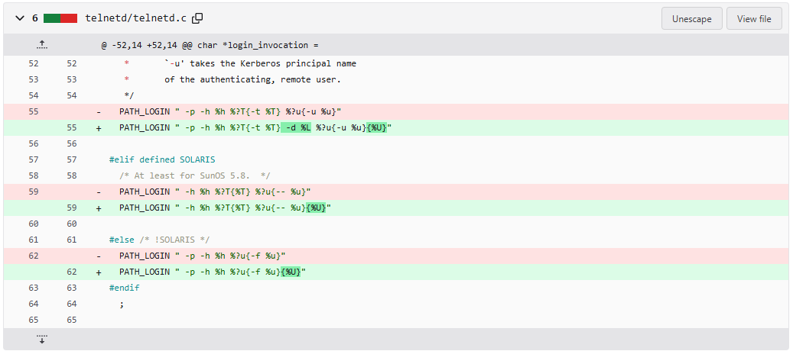
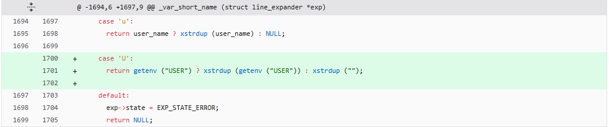
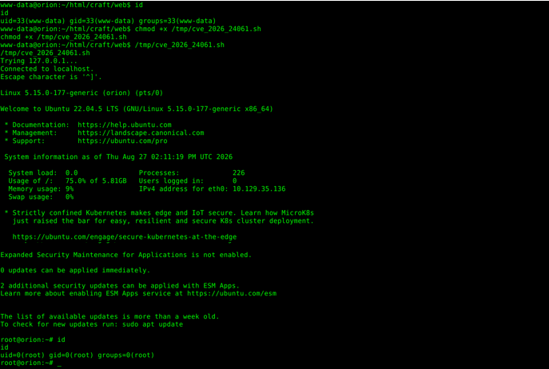

# CVE-2026-24061
I knew about this CVE because of practicing machine `Orion` on `Hack The Box`. You can check this [`link`](https://zaihanoi.github.io/wu/orion/orion.html) to read my `Orion machine Walkthrough`. In this post, I was inspired by this blog on `SafeBreach` website, you could also read it [`here`](https://www.safebreach.com/blog/safebreach-labs-root-cause-analysis-and-poc-exploit-for-cve-2026-24061/). One more time, a huge shout out from me to this weblog for its easy-to-understand and profound way of conveying knowledge about `CVE-2026-24061`.
## Root Cause and PoC Exploit
### 1. Root Cause
Generally, `CVE-2026-24061` allows attackers to perform `privilege escalation` by exploiting `GNU telnetd` service from `GNU InetUtils`. `CVE-2026-24061` was discovered by Kyu Neushwaistein (aka Carlos Cortes Alvarez) in January 2026. This CVE affected the `GNU telnetd` service up to version 2.7-2.
#### 1.1 Base Knowledge
- First of all, we will describe `GNU`. `GNU` is a recursive acronym of a suit of open-source applications which means: `GNU is not Unix`. `GNU` was invented in 1990 but at that time, it did not have kernel program. So, the solution appeared one year later, when Linux kernel program was debuted and it worked perfectly with `GNU` applications. This combination has been used widely since 1991, and there are many famous distributions of `GNU/Linux OS` such as: `ParrotOS`, `Ubuntu`, `Kali`. 
- Secondly, `GNU InetUtils` is a set of many Internet applications, tools (InetUtils: Internet Utilities) which allow OS to connect and communicate with other OS/ Computers. `GNU InetUtils` is divided into two parts: `client` tools which are used by user to connect to other OS/ Computers such as `ping`, `telnet`, `ftp` and `Server/Daemon` tools run background, receive connections, pack and unpack transfered data. `Server/Daemon` tools are usually named with letter `d` at the last position such as: `telnetd`, `ftpd`.
- `GNU/Linux OS` works with a basic motive: `one tool or application does only one work`. So, there could be many tools or applications take part in one process and handle different tasks.
- `telnet` is a service which allow users control, execute commands on backend server or computer remotely. Because it transmits data in cleartext (unencrypted packets), `telnet` is mostly replaced on modern system by `ssh` (secure shell) which uses `SSL/TLS` to encrypt data. 
#### 1.2 Root Cause Explanation
In [`this commit`](https://codeberg.org/inetutils/inetutils/commit/fa3245ac8c288b87139a0da8249d0a408c4dfb87) in 2015, there were some changes in the source code of `GNU telnetd` service. There were two important changes we have to research here:

- The `login_invocation` constant string located in `telnetd/telnetd.c`:


```c
char *login_invocation =
#ifdef SOLARIS10
  /* TODO: `-s telnet' or `-s ktelnet'.
   *       `-u' takes the Kerberos principal name
   *       of the authenticating, remote user.
   */
  PATH_LOGIN " -p -h %h %?T{-t %T} -d %L %?u{-u %u}{%U}"

#elif defined SOLARIS
  /* At least for SunOS 5.8.  */
  PATH_LOGIN " -h %h %?T{%T} %?u{-- %u}{%U}"

#else /* !SOLARIS */
  PATH_LOGIN " -p -h %h %?u{-f %u}{%U}"
#endif
  ;
```




- The `_var_short_name` function in `telnetd/utility.c`:

```c
char *_var_short_name (struct line_expander *exp)
{
  char *q;
  char timebuf[64];
  time_t t;

  switch (*exp->cp++)
    {
    case 'a':
#ifdef AUTHENTICATION
      if (auth_level >= 0 && autologin == AUTH_VALID)
	return xstrdup ("ok");
#endif
      return NULL;

    case 'd':
      time (&t);
      strftime (timebuf, sizeof (timebuf),
		"%l:%M%P on %A, %d %B %Y", localtime (&t));
      return xstrdup (timebuf);

    case 'h':
      return xstrdup (remote_hostname);

    case 'l':
      return xstrdup (local_hostname);

    case 'L':
      return xstrdup (line);

    case 't':
      q = strchr (line + 1, '/');
      if (q)
	q++;
      else
	q = line;
      return xstrdup (q);

    case 'T':
      return terminaltype ? xstrdup (terminaltype) : NULL;

    case 'u':
      return user_name ? xstrdup (user_name) : NULL;

    case 'U':
      return getenv ("USER") ? xstrdup (getenv ("USER")) : xstrdup ("");

    default:
      exp->state = EXP_STATE_ERROR;
      return NULL;
    }
}
```



I will describe about how the `GNU/Linux OS` operates when it receives a `telnet` connection. As I presented above, receiving a `telnet` connection, packing and unpacking transfered data is `GNU telnetd`'s only task. Of course, when user try to connect remotely using `telnet` they have to enter their username and password. But the problem is authenticating users' username and password is not `telnetd`'s task so after receiving request to connect signal it will call `/usr/bin/login` to check the legitable of users' username and password. If the username and password are valid, `/usr/bin/login` will "tell" `telnetd`: Hey, this user is valid , let he in. After that, `telnetd` will call another tools to set up the connect session for user and user will remotely receive a `interactive shell` and ready to execute commands on system.
##### 1.2.1 The `login_invocation` constant string
Ok, let see how the constant string `login_invocation` was changed in the commit. The `login_invocation` constant string is used by `telnetd` to call `/usr/bin/login` to check users' username and password. As you could see on the C source code above, there are three forms of `login_invocation` used in three types of OS: `SOLARIS10`, `SOLARIS` and other systems. Because `CVE-2026-24061` affected `GNU/Linux OS` only so we only have to pay attention to the third form of `login_invocation`:


```c
#else /* !SOLARIS */
  PATH_LOGIN " -p -h %h %?u{-f %u}{%U}"
#endif
```


- `PATH_LOGIN` is an object-like macro in C progamming which is declared using `#define`. In this case, `PATH_LOGIN` contains `/usr/bin/login` to authenticate users' identity. 
- `-p` is a `/usr/bin/login` flag, which means preserve the environment from previous logins.
- `-h` is a `/usr/bin/login` flag, which means users' remote hosts 
- `-f` is a `/usr/bin/login` flag, which means force `/usr/bin/login` to skip the authentication of this user's identity process.
- `%h`, `%u`, `%U` are placeholder variables which values are returned from `_var_short_name` function (we will talk about this function later).
- The picture above shows that the commit add `{%U}` at the end of `login_invocation`. This is a VERY IMPORTANT detail directly lead to vulnerability.
- We could know more about the way `telnetd` call `/usr/bin/login` through `login_invocation` source code: `/usr/bin/login` will check user identity with users' remote hosts or IP, preserve the environment from previous logins. If the user's indentity have already checked, `/usr/bin/login` will skip the authentication of this user's identity process (`-f %u`), else, `/usr/bin/login` will check user's username and password (`%U`).
##### 1.2.2 The `_var_short_name` function
In `telnetd/utility.c`, the `_var_short_name` function will return value to the placeholder variables we mentioned above. It uses the `line_expander` struct to read strings' character one-by-one.

```c
struct line_expander
{
  int state;			/* Current state */
  int level;			/* The nesting level */
  char *source;			/* The source string */
  char *cp;			/* Current position in the source */
  struct obstack stk;		/* Obstack for expanded version */
};
```

Let examine the `_var_short_name` source code: 

```c
char *_var_short_name (struct line_expander *exp)
{
  char *q;
  char timebuf[64];
  time_t t;

  switch (*exp->cp++)
...<SNIP>...
}
```

We could see that, `_var_short_name` uses parameter `exp` as a pointer of struct `line_expander`. In struct `line_expander`, the pointer `cp` is used to point to the character on strings. So, the `switch` command means: when `_var_short_name` reads alternately and meets letters representing for environment variables into user `telnet` connection requests, it will return values that could be add in to the locations of respective placeholder variables such as in `login_invocation` constant string. 
The picture above showed that `case 'U'` was added into `_var_short_name` to return users' `USER` environment variable. Here is source code of `case 'U'`:

```c
case 'U':
      return getenv ("USER") ? xstrdup (getenv ("USER")) : xstrdup ("");
```

In this case, if `telnetd` meet `'%U'` it will know that it have to add the `USER` environment variable into `login_invocation` if it contains a value, if not, string `""` (nothing) will be added into that constant string. So HERE IS THE ROOT CAUSE:

```note
The USER environment variable is fully controlled by users. And arcording to the source code, its value is directly put into login_invocation through no security or input checking layer. So user could inject many interesting things into USER environment variable =))))))). Do you remember the -f flag of /usr/bin/login? This flag is SO POWERFUL beacause of forcing /usr/bin/login auto accept the username following it. What if user set USER environment variable equals "-f root". The constant string login_invocation will become: PATH_LOGIN " -p -h <USER_HOST/IP ADDRESS> -f root" and of course user will get interactive shell with root privilege !!!
```

### 2. PoC Exploit
 
I logged into system as a low privilege user: `www-data`. After running my self-script file `cve_2026_24061.sh` according to steps and ideas from previous parts, I gained the ive of `root` user. My performance of privilege escalation through `CVE-2026-24061` was successful. 



Exploiting tutorial:
- Step 1: Download `cve_2026_24061.sh` [here](https://github.com/zaihanoi/PoC_CVE/tree/main/cve_2026_24061).
- Step 2: Permission for `cve_2026_24061.sh`:

```bash
chmod +x cve_2026_24061.sh
```

- Step 3: Set up parameters. See more with option `--help`:

```bash
./cve_2026_24061.sh --help
Usage: ./cve_2026_24061.sh [OPTIONS]

Connect to a Telnet server.

Options:
  -h, --host HOST     IP address/hostname to connect to (default: 127.0.0.1)
  -p, --port PORT     Telnet port (default: 23)
      --help          Show this help message

Environment:
  USER is set to "abc" for the Telnet process.

Examples:
  ./cve_2026_24061.sh
  ./cve_2026_24061.sh -h 192.168.1.10
  ./cve_2026_24061.sh -h 192.168.1.10 -p 2323
  ./cve_2026_24061.sh --host 192.168.1.10 --port 23
```

- Step 4: Exploit:

```bash
./cve_2026_24061.sh -p 23 -h localhost
Connecting to localhost:23 ...
Trying 127.0.0.1...
Connected to localhost.
Escape character is '^]'.

...<SNIP>...

root@orion:~#
```

### 3. Mitigation
- Disable `GNU telnetd` on your system. You could use `ssh` instead.
- If you have to use `GNU telnetd`, update `telnetd` to version 2.8 or later.  
## Key Takeaways
- Learning about CVE is very interesting because you could learn many knowledge related to that CVE.
- `GNU/Linux OS`, `GNU InetUtils`, `GNU telnetd`, `/usr/bin/login`,... how they work, how their source codes are exploitable.
- Trust the process.