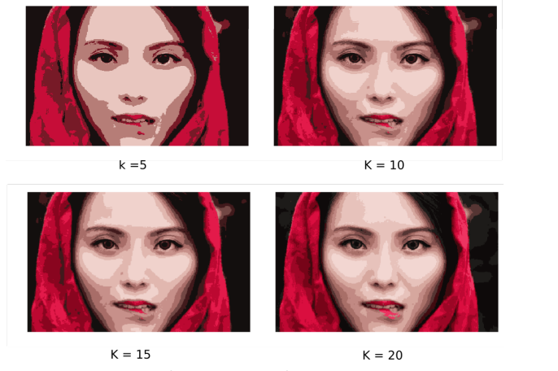
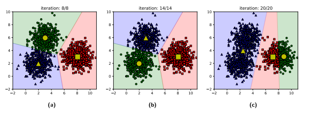

⚠️ Note: This post was inspired by the book "Machine Learning Cơ bản" (Basic of Machine Learning) by Vu Huu Tiep.
# K-MEANS CLUSTERING
K-means is one of the most basic algorithm to divide a set of data points into K clusters. Nowadays, K-means is still used in many fields of Machine Learning (ML) and Deep Learning (DL) because of being easy-to-understand, easy-to-install and high performance in spite of requiring fewer computer resources than other clustering algorithms.
## 1. Base Knowledge
Basically, this is how K-means clustering algorithm works:
- You have `N` data points $$x_i$$ with ($$1 \leq i \leq N ; i \in Z$$).
- `N` data points are put in a set of data points called `X`.
- Your target is dividing those `N` data points into K ($$K<N; K \in Z^+$$) clusters, similar data points will be put into one cluster.
- So you have to give each data point a label to show that what cluster contains that data. There are two ways to name data labels. The first way is setting the label name as `k` ($$1\leq k \leq K; k \in Z$$), for example the data point $$x_1$$ has label `k` = 5 so it is in the cluster numbered 5. 5 is only `a name to identify clusters`, we will not use `k` to compare clusters, arrange them or for other purposes.
- Another way is using a flat (1 x K) matrix called $$y_i$$ for data point $$x_i$$. If $$x_i$$ is in cluster `k`, the $$y_{ik}$$  element will equal `1` and other `K-1` elements in matrix $$y_i$$ will equal `0`. For example, the data point $$x_1$$ is in cluster number 2. If there are 5 clusters all together, the label matrix $$y_1$$ of $$x_1$$ is [0,1,0,0,0].
- Because there are `N` data points so if you combine all matrix $$y_i$$ together vertically we will have matrix `Y` (N x K) containing all labels of $$x_i$$.
- In cluster number `k`, there is a centre point (`centroid`) called $$m_k$$ ($$1 \leq j \leq K ; j \in Z$$). There is a matrix called `M` containing all K `centroids`.
## 2. Mathematical Analysis
As I said above, similar data points will be put into one cluster. So, what is "similar"? If we are working with text documents, similar is, for example, words or sentences that have the same structure of characters. But, what if we work with different forms of data such as picture? Two pictures are similar do not mean that their pixels are perfectly on the same location or painted with the same color. So, in `ML` and `DL` where data always represented by their feature vector, there is a unique way to define two data points are similar using the distance between vectors. One of the most popular algorithm to calculate distance between vectors is `Euclid algorithm`. For example, there are two vectors $$x_1$$ and $$x_2$$ in space. According to `Euclid algorithm`, the distance between $$x_1$$ and $$x_2$$ is $$||x_1 - x_2||^2_2$$. In this post, all calculate distance functions use `Euclid algorithm`.
### 2.1 Loss function
We will talk about the distance between only one data point $$x_i$$ and `centroid` $$m_k$$ if $$x_i$$ is put into cluster `k`: $$||x_i - m_k||^2_2$$. Because it is assigned to cluster `k` so the matrix $$y_i$$ of $$x_i$$ has element $$y_{ik}$$=1 so we have function:

$$
||x_i - m_k||^2_2 = y_{ik} . ||x_i - m_k||^2_2 (1)
$$

Other `K-1` elements in $$y_i$$ equal 0 so we could also write the function (1) that:

$$
||x_i - m_k||^2_2 = y_{ik} . ||x_i - m_k||^2_2 = \sum_{j=1}^{K} y_{ij} . ||x_i - m_j||^2_2 (2)
$$

Function (2) is a general function to calculate the distance between only one data point $$x_i$$ to its `centroid` $$m_k$$.

From function (2), we could build a general function to find the mean distance between all `N` data points to their `centroid`:

$$
\frac{1}{N}.\sum_{i=1}^{N} \sum_{j=1}^{K} y_{ij} . ||x_i - m_j||^2_2 (3)
$$

If we replace one data points using its `centroid`, there will appear a `loss value` equals the distance between them. So, if we do the same thing with ALL the data the mean distance between `N` points to their `centroid` will become the `loss function` of dataset `X`. By this reason, function (3) is a `loss function` of dataset `X` when replace ALL its points by `centroids` in `M` matrix:

$$
L(Y,M) = \frac{1}{N}.\sum_{i=1}^{N} \sum_{j=1}^{K} y_{ij} . ||x_i - m_j||^2_2
$$

### 2.2 Find the minimum value of Loss function
The algorithm works best when we could change the values of function parameters to minimize the `Loss function`. In this step, I will show the way to find minimum value of `Loss function`.

$$
L(Y,M) = \frac{1}{N}.\sum_{i=1}^{N} \sum_{j=1}^{K} y_{ij} . ||x_i - m_j||^2_2
$$

There are two parameters in `Loss function`: label matrix `Y` and centroid matrix `M`. This is the problem: `Y` is a `discrete variable` (there is only value 1 and 0 in `Y`) but `M` is a `continuous variable`. By this reason, we could not find the `global optimum` of `L(Y,M)`

The only solution is we will divide this problem into two parts.

- Part 1: Holding `M` fixed while optimizing `Y`.

The problem will become: we hold `centroids` on their places while we try to find the label matrix `Y` to minimize `L(Y.M)`. In other words, we have to put data points into what cluster to decrease the value of `Loss function`. So basically, the answer for part 1 is, the data points have to be put into the cluster having `centroid` closest to them.

$$
L(Y,M) = \argmin_Y \frac{1}{N}.\sum_{j=1}^{K} y_{ij} . ||x_i - m_j||^2_2
$$

- Part 2: Holding `Y` fixed while optimizing `M`.

This is the function when we hold `Y` fixed:

$$
L(Y,M) = \argmin_M \frac{1}{N}.\sum_{i=1}^{N} y_{ij} . ||x_i - m_j||^2_2 (4)
$$

Because `M` is a `continuous variable` and we could see that this function (4) is a `quadratic equation` ($$||x_i - m_j||^2_2$$) and $$\frac{1}{N}.\sum_{i=1}^{N} y_{ij}$$ is always positive so the graph of function (4) is a parabola facing upward.
Now I will find the minimum value of function (4):

- Calculate the `first derivative` of function (4):

The derivative of $$||x_i - m_j||^2_2$$ is $$(-1).2(x_i-m_j) = 2.(m_j-x_i)$$.

So the derivative of function (4) is: $$\frac{2}{N}.\sum_{i=1}^{N} y_{ij}.(m_j-x_i)$$.

- Find the solution of equation: 

$$
\frac{2}{N}.\sum_{i=1}^{N} y_{ij}.(m_j-x_i) = 0

<=> m_j . \sum_{i=1}^{N} y_{ij} = \sum_{i=1}^{N} y_{ij}.(x_i)

<=> m_j = \frac{\sum_{i=1}^{N} y_{ij}.(x_i)}{\sum_{i=1}^{N} y_{ij}}

=> m_j = \frac{\sum_{i=1}^{N} y_{ij}.(x_i)}{\sum_{i=1}^{N} y_{ij}}
$$

is a `minimizing variable` of function (4)

We could easily understand that $$\sum_{i=1}^{N} y_{ij}.x_i$$ is the sum of all points inside the cluster `j` and $$\sum_{i=1}^{N} y_{ij}$$ is the number of points inside cluster `j`. The coordinate of `centroid` $$m_j$$ is the `mean` of all points in the cluster. This is the origin of `K-means` algorithm name.

## 3. How K-means works:
From the mathematical analysis, we could generally understand how K-means works. This is the operation of K-means clustering algorithm on the `X` dataset containing `N` data points with the label matrix `Y`, the number of cluster `K` and the centroid matrix `M`:

- Step 1: `K` random data points are chosen to become `K` centroids.
- Step 2: Data points will be put into the cluster having centroid closest to it. This is the `Holding M fixed while optimizing Y` step. After putting points into clusters, `Loss function` will be calculated and if it stays unchanged (or cannot decrease any more), go to `Step 4`; else, go to `Step 3`.
- Step 3: With `K` cluster from `Step 2`, centroid will be found by calculate the mean of all points in the cluster. This is the `Holding Y fixed while optimizing M` step. After finding all `K` centroids, go to `Step 2`
- Step 4: K-means clustering algorithm stop working and we have `K` clusters.

### 3.1 K-means hierarchical clustering
Because sometimes the output is not what we expected, for example, the handwriting pictures of numbers 4 and 9 are quite similar so the output cluster may contain both 4 and 9. In this case, we could perform hierarchical clustering using K-means for higher quality of output clusters. There are two ways to cluster hierarchically:

- `Agglomerative`: At `Step 1`, we will set a big value for `K`. After clustering process, we will have `K` small clusters. At this time, if there are near centroids, we could merge those clusters and find the new centroid. After that, K-means clustering is still performed and the loop stops when you find your expected output clusters.
- `Divisive`: At `Step 1`, we will set a small value for `K` so we will have `K` big clusters. You could continuously run K-means clustering on those big cluster until you find your expected output clusters. 
## 4. Application of K-means clustering algorithm

- `Separating objects from images`

You can perform K-means clustering algorithm on pictures/images that have clearly different colors. For example, in this image there are only three main color: red, black and human skin (pink):

You could use K-means clustering algorithm with `K` = 3 to get 3 clusters: red, black and pink pixels and replaces all pixels on this image by its cluster centroid. This technique is called `Vector Quantization`. After applying this technique, the image have three clearly areas:

Now, we could separate objects (for example: face) from this image

- `Image Compression`

Using the same image and technique but this time with bigger `K`, we will have:

You could see that the higher `K` is, the clearer the output looks. There are many cases that you have to store huge images or pictures. That means you have to store billions of pixels and their locations. If you accept the small amount of data loss, you could perform K-means clustering on those pictures/images with big enough `K` value and you will only have to store `K` centroids and their location to replace original pixels. 

- `Searching data`

In huge datasets containing billions of data points, the traditional way to find data where you have to calculate the distance between your input and every data points is requires lot of time. Another way is performing K-means on that datasets and you could search data by finding the closest cluster to your input. This technique is much more faster.

- `Feature engineering`

One of the most important step in `ML` is `Feature engineering`. K-means could help you to extract features from datasets.

## 5. Drawbacks of K-means clustering algorithm and how to mitigate them

- `K` is a very important value in K-means clustering algorithm, you have to find it to perform algorithm effectively. But in many cases, you could not find `K` easily. There is a method to find `K` called [elbow method](https://en.wikipedia.org/wiki/Elbow_method_(clustering)).
- In `Step 1` of K-means clustering algorithm, `K` random data points are chosen to become `K` centroids. Researchers found that this step affects the output of algorithm.

You could solve this problem by performing K-means many times and choosing the best result. Another way is using algorithm to find the first `K` centroids such as `Kmeans++`

- K-means could not work correctly when a cluster is `inside` another cluster. The solution for this problem is using `Spectral Clustering`.
- K-means works best when clusters have circle or oval shape. So, if there are long-shape clusters the Euclid algorithm to calculate distance might not work correctly. For this case, you could use `GMM - Gaussian Mixture Models`.

## 6. Conclusion
This post gives you general knowledge about K-means clustering algorithm, one of the most basic algorithm in `Machine Learning` and `Deep Learning`, such as how it really works, its mathematical nature, its application and its drawbacks. I hope that after reading this post, you will gain useful information and knowledge about `Machine Learning` and `Deep Learning` for yourself.
