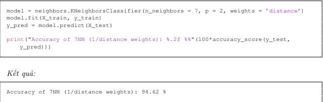

⚠️ Note: This post was inspired by the book "Machine Learning Cơ bản" (Basic of Machine Learning) by Vu Huu Tiep.
# K-nearest neighbors
K-nearest neighbors (KNN) is a `lazy-learning` algorithm due to its passive approach to data: it performs no computation during training and delays all processing until prediction. KNN can be used for both classification and regression problems.
## 1. Base Knowledge
Basically, the KNN model finds the output of a data point through checking the label of its `k` nearest data points. There are two basic ways to handle the `k` nearest data points labels in this algorithm:

- Majority voting:

The predicted data point will be labeled as the most frequent label in `k` nearest data points.

Choosing an appropriate value for k is critical: if k is too small (e.g., k = 1), the model will overfit; if k is too large, the model will underfit. The `k` choice step in this approach is very important.

- Using weight value:

This a more complicated version of Majority voting. In majority voting, all neighbor points carry equal weight. However, closer neighbors should intuitively have a stronger influence on the prediction. Therefore, we assign weights that are `inversely proportional` to their distances.

There are two ways to find the weight values for data points:

1, You can use `scikit-learn` and set `weights='distance'` and the code will do this task for you. The default parameter is `weights='uniform'`, where all points carry equal weight (Majority voting).

2, You can manually calculate weight values using the following formula:

$$
w_i = exp (-\frac{||z-x_i||_2^2}{\sigma^2})
$$

where:

- $$w_i$$ is a weight value of $$i^{th}$$ nearest data point
- $$exp(x) = e^x$$
- $$z$$ is predicted point
- $$x_i$$ is dataset point
- $$\sigma$$ is a positive number to control the decrement of weight value.

From the above formula we could see that when the distance between $$x_i$$ and $$z$$ is 0 the weight of $$x_i$$ = 1 that mean $$z$$ and $$x_i$$ have the same label.

## 2. Mathematical Analysis
The only math problem in KNN is the equation of calculating the distance between points to find the `k` nearest points.
Like many other algorithms, we use `Euclid algorithm` in KNN to calculate distance. Lets start with the easiest math problem: finding the distance between two points with two feature vectors.
We have $$X$$ is a data point into dataset and $$Z$$ is a predicted datapoint. Their feature vectors are $$x$$ and $$z$$ respectively. Their distance using `l2 norm (Euclid algorithm)` is:

$$
||z-x||_2^2 \; ; \; x = [x_1,x_2,..,x_n] \; ; \; z = [z_1,z_2,...,z_n] \tag{0}
$$

Equation (0) expands to:

$$
(z_1-x_1)^2 + (z_2-x_2)^2 +...+ (z_n-x_n)^2 \tag{1}
$$

We can further analyze and expand equation (0):

$$
||z-x||_2^2 = (z-x)^T . (z-x) = z^T . z - z^T . x - x^T . z + x^T . x \tag{2}
$$

Because $$z^T . x = x^T . z$$ , so (1) equals:

$$
||z||^2_2 + ||x||^2_2 - 2x^T . z \tag{3}
$$

After handling process, we have (3) is a new formula to calculate the distance between two points using `Euclid algorithm`. 

Now, let compare formula (3) and original one (1). In (3), we will already have feature vectors $$z$$ and $$x$$ so we will only have to calculate $$2x^T . z$$. On the other hand, in (1), we have to calculate all the $$(z_i-x_i)^2$$ pairs. In the reality problem, we have to handle thousands of data points, the operational time costs are very important. So, in KNN we will use the formula (3) to calculate distances.

We could also build the general form of formula (3). $$X$$ is a matrix of all data points $$x_i$$ in dataset. $$Z$$ is a matrix containing all predicted point $$z_j$$. The general form (4) of formula (3) could calculate distances between all dataset points and predicted points:

$$
||Z||^2_2 + ||X||^2_2 - 2X^T . Z \tag{4}
$$

There are also many other functions that could calculate distances efficiently such as: `cdist` in `scipy.spatial.distance` and `pairwise_distances` in `sklearn.metrics.pairwise`. We could use both of them or formula (4) in our KNN model.

## 3. Application of KNN algorithm
### 3.1 KNN in classification problem
`Section 1` covers how class labels are determined in classification. Below, we look at how KNN handles regression.
### 3.2 KNN in regression problem
In regression problem, we could also use the same method.
We have `k` nearest points $$x_i \; (0<i<k+1; i\in Z)$$ with their outputs: $$y_i$$ and their weight values: $$w_i$$. There is a predicted point $$z$$. The output of $$z$$ will be:

$$
\frac{w_1.y_1+w_2.y_2+...+w_k.y_k}{w_1+w_2+...+w_k}
$$

## 4. Advantages and Drawbacks of KNN algorithm
### 4.1 Advantages:
- The algorithm is simple and easy to implement.
- After finding `k` nearest points the predicted output will be found easily.
### 4.2 Drawbacks:
- When `k` is small, the model is prone to overfitting and highly sensitive to noise or outliers.
- Calculating distances to all training points for every prediction is time-consuming and memory-intensive for large datasets. 

## 5. Conclusion
This post gives you general knowledge about KNN algorithm, one of the most basic algorithm in `Machine Learning` and `Deep Learning`, such as how it really works, its mathematical nature, its application and its drawbacks. I hope that after reading this post, you will gain useful information and knowledge about `Machine Learning` and `Deep Learning` for yourself.